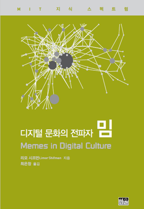
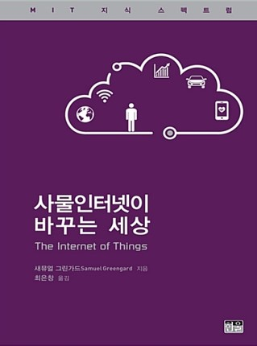
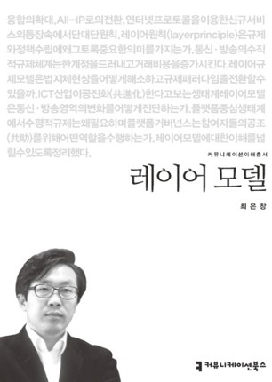
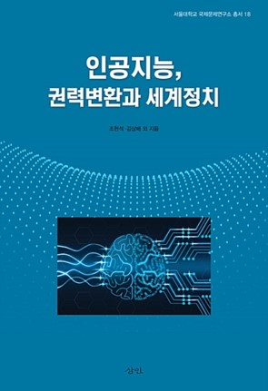

<body bottommargin="0">


	


<!-- /.tiles -->

 
 
 
 
 

 I am a Korean legal scholar and a fellow of the Free Internet Project, housed in Illinois Institute of Technology at Chicago. I have been a member of Law Committee,<a href="https://ethicsinaction.ieee.org/">IEEE Global Initiative on Ethics of Autonomous and Intelligent Systems</a>, and Expert Council of Robot Ethics of Korea. My current research focuses on governance of artificial intelligence and regulatory policy on emerging technologies. Recently I have consulted with <a href="https://www.kisdi.re.kr/"> Korea Information Society Development Institute (KISDI)</a>, <a href="http://www.stepi.re.kr/">Science and Technology Policy Institute (STEPI)</a> and South Korean <a href="https://www.4th-ir.go.kr"> Presidential Committee on the Fourth Industrial Revolution</a>on AI policy, and taught multistakeholder perspectives on ethical framework of AI at <a href="https://www.icann.org/news/announcement-2-2019-05-14-en"> the Asia Pacific Internet Governance Academy(APIGA)</a>. Previously, I was a resident fellow of <a href="https://https://law.yale.edu/isp"> Information Society Project at Yale Law School</a>, where I served as a coordinator of Harvard-Yale Cyberscholar Working Group. I also have held an appointment as a visiting scholar at <a href="https://www.law.ox.ac.uk/centres-institutes/centre-socio-legal-studies"> Centre for Socio-Legal Studies,Oxford Law Faculty</a>. I have served an invited expert of <a href="https://www.w3.org/2011/07/privacy-ig-charter"> W3C Privacy Interest Group</a> and a fellow of STEPI, a leading think tank of South Korea.

 My articles primarily addressed underlying legal, policy issues associated with computer algorithm, Internet architecture, data privacy in cloud computing, data ownership, and social media platform. He has auhored books <i>Layered Model of Regulation', 'Al Governance</i>(forthcoming) and <i>The Future of Fake News</i>(forthcoming), and also translated <i>'The Weath of Networks </i> written by Yochai Benkler(Yale Univ Press),<i>'Meme in Digital Culture,</i> and <i>How Internet of Things Change the World</i> (MIT Press). 

 I am on a steering committee of the Korea Internet Governance Alliance (KIGA) that brings stakeholders together to participate in the dialogue on Internet policy. At <a href="http://krigf.kr"> Korea Internet Governance Forum(Kr-IGF)</a>, I have organized workshops on the future of AI, ethical framework for a good AI society, Cybersecurity & Encryption Policy, an Data Governance in social networks. A decade ago, I founded the <a href="http://www.povertyinfo.org"> Global Poverty Public Awareness Project</a>, an information commons initiative that provides citizens with open  knowledge about issues affecting global poverty and preventable diseases.

ACADEMIC INTERESTS  
<blockquote>  AI: Ethical and Legal Challenges (Governing AI) 
  Accountability for Algorithm and Artificial Intelligence  
  Platform Liability  
  Data Localization  
  Data Privacy, Data Governance  
  Open Data for Sustainable Development   
  Cybersecurity Policy: A Multi-stakeholder Approach  
  Intellectual Property 
  Information Commons   
  The Interplay of Law,Science,and Technology 
  </blockquote> 
