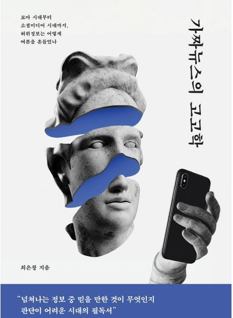

<body bottommargin="0">


	


<!-- /.tiles -->

 
 
 
 
  
  
  
  
  
  
  

 Eun Chang Choi, 최은창(崔恩彰), is a leading expert in artificial intelligence governance, and a scholar of issues at the nexus of machine learning, technology policy, and intellectual property. His publications investigated (1) legal and policy issues associated with AI systems(bias, risk management and accountability); (2) global governance frameworks for AI safety; (3) copyright of AI-generated content and fair Learning; (4)(Mis)aligned AI systems with human values; and (5) political economy of intellectual property and public health. He has been actively engaging in global standard-setting dialogues at IEEE Standards Working Groups <a href="https://sagroups.ieee.org/7003/"> ‘Algorithmic Bias Considerations’(P7003)</a>, and <a href="https://sagroups.ieee.org/7002">‘Data Privacy Process’(P7002)</a>. He also participates in <a href="https://www.intgovforum.org/en/pnai"> the Policy Network on AI(PNAI) </a> of the Internet Governance Forum(IGF) of the United Nations, as well as <i> ‘AI Policy Forum’</i> of<a href="http://kaail.kr"> the Korean Association for AI Law (KAAIL)</a>. He is currently a lecturer at KyungHee University in Seoul, and the head of AI Policy & Governance at <a href="https://www.armilla.ai"> Armilla AI </a> Asia office, that audits and assesses ML/AI systems for safety and trustworthiness.  

  
Having navigated the interplay of technology policy and regulatory design, he has authored books on <i>The Layered Model of Internet Regulation</i>(2015) and <i>The Archaeology of Disinformation</i>(2020), along with several co-authored works, <i>The Ethics and Governance of Artificial Intelligence </i> (2021), <i>Twenty Key Concepts of Digital Technology and Society</i>(2022), <i>The Rise of Artificial Intelligence and the Power Shift in Global Politics</i> (2018) and<i> Technology Terminology of Digital Copyright </i> (2016). Previously, he was a Fellow of <a href="https://law.yale.edu/isp"> the Information Society Project, Yale Law School</a> for which he served as a coordinator of Harvard-Yale-MIT Cyberscholar Working Group, and worked as a Non-Resident Fellow of <a href="https://thefreeinternetproject.org/"> the Free Internet Project </a> at <a href="https://web.iit.edu/"> Illinois Institute of Technology</a>. Thereafter, he served as a Fellow of <a href="https://www.stepi.re.kr/site/stepien/main.do"> Science and Technology Policy Institute(STEPI)</a>, a global think tank of science and technology, where he has conducted research on regulatory science. Prior to that, he was on a full scholarship from the Korean government holding an appointment as a Visiting Scholar of <a href="https://pcmlp.socleg.ox.ac.uk/about-us/"> Programme in Comparative Media Law and Policy(PCMLP)</a>, and <a href="https://www.law.ox.ac.uk/centres-institutes/centre-socio-legal-studies"> Centre for Socio-Legal Studies </a> at <a href="https://www.law.ox.ac.uk/"> Law Faculty, University of Oxford</a>.   
       
  As the Editor-in-Chief of <a href="https://www.technologyreview.kr/"> MIT Technology Review (Korean Edition)</a>, he penned thought-provoking articles on AI regulations, open-source AI, data ethics, platform liability, disinformation war, and technology policy. On the other hand, he organized the <a href="https://aisummit.co.kr/"><i> AI Summit Seoul</i></a>, an annual event focusing on emerging AI trends and advancements. He is widely recognized as an expert advisor on public policies for emerging technologies and ICT regulation, sought after by government agencies and public sector research institutes, which include <a href="https://eng.kcc.go.kr/user/ehpMain.do"> Korea Communications Commission(KCC) </a>,<a href="https://www.kisdi.re.kr/"> Korea Information Society Development Institute(KISDI)</a>, <a href="https://www.stepi.re.kr/site/stepien/main.do"> Science and Technology Policy Institute(STEPI)</a>, and <a href="https://kiria.org/eng/"> the Robotics Institute</a>. More importantly, he spearheaded crucial chapters in the groundbreaking report <a href="https://mediasvr.egentouch.com/egentouch.media/apiFile.do?action=view&SCHOOL_ID=1007002&URL_KEY=7f83a834-79bb-4ab9-8329-45738d755d92"> “The AI Ethics and Policy Responses of Industrial Sectors in the Fourth Industrial Revolution”</a> submitted to the Presidential Committee of the Fourth Industrial Revolution, which shaped Korea’s AI policy regarding trustworthy artificial intelligence for everyone. And he took charge of analysis on AI bias, risk and accountability of algorithms in a government research <a href="https://scienceon.kisti.re.kr/commons/util/originalView.do?cn=TRKO202100006631&dbt=TRKO&rn="> ICT-based Solutions to Social Problems in Intelligent Information Society </a>.  
      
  His teaching experiences include the <a href="https://www.unesco.org/en/unitwin/about"> UNESCO UNITWIN Program </a> for  <a href="https://unitwin.handong.edu/en/"> Next-Generation AI Training</a> in Rwanda, Peru and Indonesia, where he has taught on AI systems design, information law and data governance in sustainable development context. He was invited to educate government officials drawn from Asian countries at <a href="https://www.itu.int/en/ITU-D/Regional-Presence/AsiaPacific/Pages/Events/2019/Artificial-Intelligence-Overview-and-Applications.aspx"> ITU Academy of Centres of Excellence(CoE) for Asia and the Pacific.</a> ‘The Global Information Society and Policy’ and ‘International aspects of e-Commerce Law’ courses were delievered at <a href="https://int.korea.edu/kuis/index.do#none)"> Korea University Graduate School of International Studies </a>, where he remained as a faculty member for nine years. In addition, he taught ‘Ethical Issues in Management Information Systems’ course at <a href="https://gsb.ewha.ac.kr/gsbeng/index.do"> Ewha Womans University Graduate School of Business </a>,‘Media Sphere and International Politics’ at <a href="https://friend.konkuk.ac.kr/do/Eng/Index.do"> Konkuk University,</a> and ‘International Intellectual Property Law’ at <a href="https://www.mju.ac.kr/us/3422/subview.do"> Myongji University</a>. In 2019, he presented about ‘AI Governance’ at <a href="https://community.icann.org/display/GSEAPAC/APIGA+2019"> Asia Pacific Internet Governance Academy(APIGA)</a> organized by <a href="https://www.icann.org"> Internet Corporation for Assigned Names and Numbers (ICANN).</a> Furthermore, he discussed on data privacy in smart cities at a workshop <a href= "https://www.intgovforum.org/multilingual/content/igf-2019-ws-182-data-governance-for-smarter-city-mobility">‘Data Governance for Smarter City Mobility’</a> organized by <a href= "https://www.hiig.de/en/project/data-governance/"> Humboldt Institute for Internet and Society (HIIG)</a> in Berlin. On the top of that, he delivered a speech on ‘IP Address and Cross-border Cooperation for Resolving the Cyber Attribution Challenge’at <a href="https://conference.apnic.net/48/program/schedule/#/day/6"> Asia Pacific Network Information Centre Conference (APNIC 48)</a> in Chiang Mai,Thailand.  
     
    Since 2016 he has been serving for <a href= "https://WWW.kiga.or.kr"> Korea Internet Governance Alliance(KIGA)</a> representing South Korea’s Internet Community at <a href="http://www.intgovforum.org/multilingual/content/igf-regional-and-national-initiatives"> National Regional Initiatives(NRI)</a> moderated by<a href="http://intgovforum.org/multilingual/"> the IGF Secretariat of United Nations Department of Economic and Social Affairs </a>, and have been involved in <a href="http://www.intgovforum.org/multilingual/content/bpf-internet-of-things-iot-big-data-and-artificial-intelligence-ai-2018">the Best Practice Forum(BPF) IoT-Big Data-AI</a>. At <a href="http://krigf.kr"> Korea Internet Governance Forum(Kr-IGF)</a>, he organized workshops on ethical & policy framework for AI society, cybersecurity policy, and data governance. He is elected as a member of <a href="https://www.aprigf.asia/members.html"> Multi-stakeholder Steering Group of the Asia Pacific Regional IGF</a>.   
       
  In terms of his dedication to non-profit causes, he has been pivotal in directing <a href="http://www.povertyinfo.org"> the Global Poverty Public Awareness Project</a>(GP3Korea, <a href="http://www.povertyinfo.org"> www.povertyinfo.org)</a>. Launched in 2010, the Project has accomplished a number of milestones in creating public knwoledge on the most pressing human rights issue. With volunteers and public interest lawyers, he had activated the not-for-profit that generates and shares openly accessible knowledge about <a href= "http://povertyinfo.org/300.9_issues.html"> issues affecting global poverty</a> (inclusive Internet access, AI for Good, ICT for Development, access to essential medicine, patent waiver for public health). <a href="http://www.povertyinfo.org">Povertyinfo.org</a> is a peer-to-peer digital media project for humanitarian ends that has been inspired by<a href="https://law.yale.edu/isp/about/initiatives/access-knowledge"><i> Access to Knowledge</i> </a> initiative and <a href= "https://civic.mit.edu/"> Civic Media at MIT</a>. Rather than focusing on poverty’s hardships, it tackles the root causes through <a href="https://sdgs.un.org/sites/default/files/2022-06/ONLINE_STI_SGDs_GUIDELINES_EN_v3_0.pdf"> innovative solutions </a> and open data-driven strategies that facilitate achieving sustainable development goals(SDGs). In this way, he has been continuously striving to raise the voices of marginalized groups in the least developed countries, placing an emphasis on the human rights dimension of poverty. In collaboation with many volunteers, it fosters social awareness on global poverty through a MediaWiki-based content management system, and commons-based peer production method.    
       
    He earned a law degree from <a href="https://law.yale.edu/"> Yale Law School</a>, serving as the editor of <a href="https://yjolt.org/"> Yale Journal of Law & Technology</a>, and <a href="https://www.yalejreg.com"> Yale Journal on Regulation. </a> Before becoming a Wellington Fellow at Yale, he had completed doctoral coursework in intellectual property law & information law at <a href="http://law.snu.ac.kr/index_en.php"> Seoul National University,</a> and was awarded scholarships from Duke-Geneva Institute in Transnational Law at <a href="https://www.unige.ch/droit/transnational/en/certificat"> Université de Genève</a>, and from Internet Law Program offered by <a href="https://www.cyber.harvard.edu/"> Berkman Klein Center for Internet & Society</a>,<a href="https://hls.harvard.edu"> Harvard Law School</a>. He holds Advanced Data Analytics Semi-Professional(ADsP), Certified Information Privacy Professional (US Private/Europe), Certified Information Systems Security Professional(CISSP) and Certified in Risk and Information Systems Control(CRISC). 

   
 <strong> ARTICLES, BOOKS & CHAPTERS </strong>  
▪ “Who Owns the Baby Shark Dance?: A Copyright Dispute in South Korea” Harvard Technology Review (forthcoming)   
▪ <a href="https://alook.so/posts/54t4woG">“What Would Plato Make of ChatGPT that Generates False Content?”  </a> Alookso Magazine (March 2023)  
▪ “Open-sourced mRNA COVID 19 Vaccine Manufacturing in Africa’s WHO Tech Hub” <a href="https://blog.naver.com/gp3project/222993202700"> Povertyinfo Blog</a>(Jan.2023)   
▪ “Imbuing Democratic Values into the Democratization of Artificial Intelligence” Alookso Magazine <a href="https://alook.so/posts/q1tpJvM">1</a>, <a href="https://alook.so/posts/mbtE1zy"> 2</a>, <a href="https://alook.so/posts/KmtBEro">3 </a> (Dec.2022)   
▪ <a href="https://www.technologyreview.kr/ai-%eb%af%bc%ec%a3%bc%ed%99%94%eb%a5%bc-%ec%9d%b4%eb%81%84%eb%8a%94-%eb%8c%80%ea%b7%9c%eb%aa%a8-%ed%98%91%ec%97%85-ai-%eb%aa%a8%eb%8d%b8/"> “Mass-Collaborative Open-Source Large AI Models Set to Lead AI Democratization” </a> MIT Technology Review (Nov.2022)    
▪ “AI Large Language Models and AI Democratization”<a href="http://cdss.yonsei.ac.kr/"> Center for Digital Social Science, Yonsei Univ, </a>Issue Brief Vol.48 (Nov.2022)    
▪ <a href="https://www.technologyreview.kr/%ed%95%a9%ec%84%b1-%eb%8d%b0%ec%9d%b4%ed%84%b0%ec%9d%98-%ec%8b%9c%eb%8c%80%ea%b0%80-%ec%98%a4%ea%b3%a0-%ec%9e%88%eb%8b%a4/"> “The Promise and Pitfall of Synthetic Data in Training AI Systems” </a> MIT Technology Review (Oct.2022) 
▪ <a href="https://www.technologyreview.kr/%ed%85%8d%ec%8a%a4%ed%8a%b8%eb%a5%bc-%ec%9d%b4%eb%af%b8%ec%a7%80%eb%a1%9c-%eb%b0%94%ea%bf%94%ec%a3%bc%eb%8a%94-ai%eb%a5%bc-%eb%91%98%eb%9f%ac%ec%8b%bc-%ec%a0%80%ec%9e%91%ea%b6%8c-%eb%85%bc%ec%9f%81/"> “AI-generated Images from Text Sparking Copyright Controversy”</a> MIT Technology  Review (Sept.2022) 
▪ Book Chapter,“On Technology Risk” in <i> <a href="https://sapyoung.com/bbs/board.php?bo_table=booklist2&wr_id=431"> Twenty Key Concepts of Digital Technology and Society </a> </i>, Publisher :社會評論(Sept.2022)  
▪ Book Translation <a href="http://www.yes24.com/Product/Goods/110725374"><i> Memes in Digital Culture</i>,</a> Publisher: MIT Press, Hanul MPlus (July 2022)  
▪ <a href="https://alook.so/posts/M9t4PDq"> “The Ethics of Metaverse and Law: From Sexual Exploitation to Fraud in Virtual Space” </a> Alookso Magazine (July 2022) 
▪ <a href="https://www.ibric.org/myboard/read.php?id=4087&Page=1&Board=REPORT&TodayReview=1/"> “Global COVID-19 Vaccine Equity, Differential Pricing and the Waiver of Patents”</a> BRIC BioWave <a href="https://www.ibric.org/biowave/bio_webzine_index.php"> POSTECH </a>(April 2022) 
▪ <a href="https://alook.so/posts/54t3ZMx"> “Fragmented Media, Delusive Deepfakes, and Hacktivism in Russia-Ukraine War” </a> Alookso Magazine (April 2022)  
▪ <a href="https://www.technologyreview.kr/%ec%9a%b0%ed%81%ac%eb%9d%bc%ec%9d%b4%eb%82%98-%ec%a0%84%ec%9f%81%ec%9d%b4-%eb%b6%88%eb%9f%ac%ec%98%a8-%ec%8a%a4%ed%94%8c%eb%a6%b0%ed%84%b0%eb%84%b7/">“How Russia-Ukraine War Accelerates Internet Fragmentation?” </a> MIT Technology Review(March 2022) 
▪ <a href="https://www.key4biz.it/splinternet-la-guerra-in-ucraina-divide-linternet/396648/"> “Splinternet: la guerra in Ucraina divide l’internet” </a> <i> Democrazia Futura </i>, Rome, published in Italian (March 2022) 
▪ <a href="https://www.technologyreview.kr/%ec%9a%b0%ed%81%ac%eb%9d%bc%ec%9d%b4%eb%82%98-%ec%a0%84%ec%9f%81%ec%9d%98-%ec%9d%b4%eb%a9%b4-%ec%84%9c%eb%b0%a9%ea%b3%bc-%eb%9f%ac%ec%8b%9c%ec%95%84%ec%9d%98-%ed%97%88%ec%9c%84-%ec%a0%95%eb%b3%b4/">“Disinformation War in Ukraine-Russia Crisis” </a>MIT Technology Review(March 2022) 
▪ <a href="https://www.technologyreview.kr/%ed%8e%98%ec%9d%b4%ec%8a%a4%eb%b6%81%ec%9d%80-%ec%a0%80%ec%86%8c%eb%93%9d-%ea%b5%ad%ea%b0%80%eb%93%a4%ec%9d%98-%ec%9d%b8%ed%84%b0%eb%84%b7-%ec%a0%91%ec%86%8d%ec%9d%84-%eb%8f%95%ea%b3%a0-%ec%9e%88/">“Does Facebook’s Free Basics Help Internet Connectivity in Low-income Countries?” </a> MIT Technology Review(Feb.2022)  
▪ <a href="https://www.technologyreview.kr/%ec%bb%b4%ed%93%a8%ed%84%b0-%ec%95%8c%ea%b3%a0%eb%a6%ac%eb%93%ac%ec%9d%80-%ec%9c%a4%eb%a6%ac%ec%a0%81-%ec%a0%84%ed%88%ac%eb%b0%a9%eb%b2%95%ec%9d%84-%eb%b0%b0%ec%9a%b8-%ec%88%98-%ec%9e%88%ec%9d%84/"> “Can Computer Algorithms Learn about the Ethics of Warfare?” </a> MIT Technology Review(Feb.2022) 
▪ Chapter Contribution “Bias, Risk and Accountability of Algorithms” in a government think thank’s research report <a href="https://scienceon.kisti.re.kr/commons/util/originalView.do?cn=TRKO202100006631&dbt=TRKO&rn="> ICT-based Solutions to Social Problems in Intelligent Information Society (II)</a>  Korea Information Society Development Institute (KISDI) (2021)  
▪ <a href="https://www.technologyreview.kr/nft-%ec%97%b4%ed%92%8d-%ec%96%bc%eb%a7%88%eb%82%98-%eb%a9%8b%ec%a7%80%ea%b3%a0-%ec%96%bc%eb%a7%88%eb%82%98-%ec%9c%84%ed%97%98%ed%95%a0%ea%b9%8c/"> “NFT Craze:How Dazzling is it and also Risky?” </a> MIT Technology Review(Dec.2021) 
▪ <a href="https://www.technologyreview.kr/누가-메타버스-플랫폼을-구축하고-있고-메타버스-세/">“Who’s Building Metaverse Platforms and How Metaverse World to be Governed?” </a> MIT Technology Review (Nov.2021) 
▪ <a href="https://www.ibric.org/myboard/read.php?Board=report&id=3843">“CRISPR-Cas9 Patent War and the Implication for Microbial Sciences”</a> BRIC BioWave Vol.23, No.9, <a href="https://www.ibric.org/biowave/bio_webzine_index.php"> POSTECH</a>(Sept.2021) 
▪ “The Race for Hyperscale AI Language Models” <a href="https://www.skplanet.com/business/ictIot"> Monthly Magazine SK Planet </a>(Sept.2021)   
▪ <a href="https://www.technologyreview.kr/%ec%a3%bc%eb%ac%b8%ed%98%95-%ed%94%8c%eb%9e%ab%ed%8f%bc-%ea%b7%9c%ec%a0%9c%ec%99%80-%ea%b8%b1-%ec%9d%b4%ec%bd%94%eb%85%b8%eb%af%b8%ec%9d%98-%eb%af%b8%eb%9e%98/?fbclid=IwAR1sfDzfWXv-sdOnKCrOSIlD0PSPpXuAuzSBjD4gz-2Qjuc6NhNq2A100Iw">“Algorithmic Antagonisms of Gig Workers and Regulations on Food-Delivery Platforms” </a> MIT Technology Review (Aug.2021)  
▪ <a href="https://www.technologyreview.kr/communicatioins-decency-act-misinformation/"> “The CDA Section 230 Reform to Reduce Dis/Misinformation in Digital Platforms” </a> MIT Technology Review(May 2021)  
▪ <a href="https://www.technologyreview.kr/why-data-ethics-is-important-in-ai-business/">“Why Data Ethics Matters to AI Business?” </a> MIT Technology Review(April 2021) 
▪ <a href="https://www.technologyreview.kr/why-ai-chatbots-fail-lee-luda-part-1/"> “Why AI Chatbots Fail?:The Ethics of Lee Luda’s Discriminatory Remarks” I</a>, <a href="https://www.technologyreview.kr/why-ai-chatbots-fail-lee-luda-part-2/"> II</a> MIT Technology Review(March 2021) 
▪ <a href="https://www.kisdi.re.kr/report/view.do?key=m2101113025377&arrMasterId=4333446&masterId=4333446&artId=555875"> “The History of Chatbots and Tech Policy: Rethinking Eliza, GPT-3, & LeeLuda” </a> <i> AI Outlook </i> Vol.4 <a href="https://www.kisdi.re.kr/eng/index.do"> KISDI </a>(April 2021) 
▪ “The Disparity in Risk Perception and Modalities for AI Governance”, <a href="https://www.kyobobook.co.kr/product/detailViewKor.laf?mallGb=KOR&ejkGb=KOR&barcode=9791130337722&orderClick=LA6"> <i> The Ethics and Governance of AI </i>,</a> 博英社(2021)   
▪ Book <a href="http://www.yes24.com/Product/Goods/87629913?scode=032&OzSrank=1"> <i> The Archaeology of Disinformation: How Fake News/Propaganda Manipulated Public Opinion from Ancient Rome to Digital Public Sphere of Social Media </i>,</a> Publisher:DongAsia(東亞細亞)(2020) (Acclaims :<a href="https://www.pdjournal.com/news/articleView.html?idxno=71119"> PD Journal </a>, <a href="http://ch.yes24.com/Article/View/44483">Yes 24</a>, <a href="http://radio.sbs.co.kr/gorealra/player/?podId=P0000000874&vodId=V0000328499"> SBS Radio </a>, <a href="https://bit.ly/3aVFA4z"> Magazine Chaeg(冊)</a>, <a href="http://www.dt.co.kr/contents.html?article_no=2020030302103869061001"> Digital Times</a>, <a href="https://www.mk.co.kr/news/culture/view/2020/02/155878"> Maeil Business News</a>, <a href="https://www.asiae.co.kr/article/2020022811050161321&mobile=Y"> Asia Economy</a>, <a href="http://www.donga.com/news/article/all/20200216/99724450/1"> Dong-a Ilbo</a>, <a href="https://www.seoul.co.kr/news/newsView.php?id=20200313020005&wlog_tag3=naver"> Seoul Shinmun</a>,<a href="https://www.jnilbo.com/2020/02/20/2020022015101829561/"> Joennam Ilbo</a>, <a href="https://www.jjan.kr/news/articleView.html?idxno=2080584"> Jeonbuk Ilbo</a>, <a href="http://www.segye.com/newsView/20200214510584?OutUrl=naver"> Segya Ilbo</a>, <a href="https://www.kyosu.net/news/articleView.html?idxno=48054"> Kyosu Shinmun </a>, <a href="http://www.knnews.co.kr/news/articleView.php?idxno=1320910"> Kyoungnam News</a>,<a href="https://www.sedaily.com/NewsVIew/1YYX4ZYYI0"> Seoul Economic Daily</a>, <a href="https://www.ujeil.com/news/articleView.html?idxno=260732"> Ulsan Jeil</a>, <a href="https://www.hankookilbo.com/News/Read/202003161003380783"> Hankook Ilbo 1 </a>, <a href="https://www.hankookilbo.com/News/Read/202002131753026467?did=PA&dtype=3&dtypecode=4201"> 2 </a>,<a href="https://www.kwangju.co.kr/article.php?aid=1582191840689788026"> Kwangju Ilbo</a>, <a href="https://www.unipress.co.kr/news/articleView.html?idxno=771"> Univ Press </a>, <a href="https://www.fnnews.com/news/202002131701022957"> Financial News</a>, <a href="https://www.news1.kr/articles/?3842792"> News 1</a>,<a href="https://www.naeil.com/news_view/?id_art=341418"> Naeil News</a>, <a href="https://www.youtube.com/watch?v=MpeoOBXadZ8&feature=youtu.be&t=241"> Hellmouth Book Review </a>, <a href="https://m.blog.naver.com/media_trust/222648627826"> Media Trust </a>,<a href="https://slownews.kr/98439"> Slow News </a>, <a href="https://www.yna.co.kr/view/AKR20221012124400371?input=1195m"> Yonhap News </a>)  
▪ <a href="https://zdnet.co.kr/view/?no=20201201123601"> “Personal Data Privacy Class Actions in European Courts” </a>, ZDNet Korea(Dec.2020)  
▪ <a href="https://github.com/eunchangchoi/Presentations/blob/master/The_Truth_that_the_History_of%20Fake_News_Says_to_Us_EunChangChoi2020.pdf">“The Truth of the Long History of Fake News and Falsehoods”</a> Biweekly 企劃會議 Vol.518 (Aug.2020)    
▪ “Algorithm Accountability in AI Systems” in<a href="https://www.yes24.com/Product/Goods/62006191?scode=032&OzSrank=2"><i> The Rise of AI and Power Shift in Global Politics,</i> </a> Publisher:Samin(三仁)(2018)   
▪ <a href="https://nosmk.khealth.or.kr/nsk/user/extra/ntcc/nosmokeFile/fileView/jsp/Page.do?siteMenuIdx=81&dataNo=31&dataGr=4&fileNo=522&postIdx=562&level1Idx=8&level2Idx=31&datalv=1"> “California's Regulation on Flavored Tobacco Products:Menthol” </a>, Korea Health Promotion Institute (2018)    
▪ <a href="https://www.dbpia.co.kr/journal/articleDetail?nodeId=NODE06673543"> “Algorithm Governance” </a><i> Future Horizon +</i> Vol.33 (2017 Summer), Science and Technology Policy Institute (2017)   
▪ Book Translation <a href="http://www.kyobobook.co.kr/product/detailViewKor.laf?ejkGb=KOR&mallGb=KOR&barcode=9788946062726&orderClick=LAH&Kc="> <i> The Internet of Things,</i> </a> Publisher: MIT Press(2015), Hanul MPlus(2017)  
▪ Co-authored <a href="http://www.jksrnt.org/journal/view.html?doi=10.25055/JKSRNT.2016.7.2.74"> “Factors Associated with Use of Menthol Cigarettes of College Students and Male Workers” </a> Journal of the Korean Society for Research on Nicotine and Tobacco (July 2016)  
▪ “Can Robots be Held Legally Responsible for Their Actions?”in <a href="https://bit.ly/3cT4dSs"><i> Does Technology Make Better Future: AI, the Fourth Industrial Revolution and Future of Humanity</i></a> by Science & Technology Policy Institute, Publisher:Random House Korea (2016)   
▪ Co-authored Book <a href= "https://copyright.or.kr/information-materials/publication/research-report/view.do?brdctsno=40222&pageIndex=1&brdctsstatecode=&brdclasscode=&searchTarget=SUBJECT&nationcode=&brdno=34&noticeYn=&etc1=&searchText=%EA%B8%B0%EC%88%A0%EC%9A%A9%EC%96%B4&portalcode=04&servicecode=06&searchkeyword=&portalcode04=#"><i> Technology Terminology of Digital Copyright </i> </a>,<a href="https://www.copyright.or.kr/eng/main.do"> The Korea Copyright Commission </a>(2016)  
▪ <a href="https://www.stepi.re.kr/site/stepiko/PeriodicReportView.do?reIdx=28&pageIndex=1&cateCont=A0505&searchYear=&searchCondition=2&searchKeyword=%EC%B5%9C%EC%9D%80%EC%B0%BD&searchSort=PUBLIC_DT"> “Legal and Ethical Controversies of AI”</a> <i> Future Horizon +</i> Vol.28 (2016 Spring), Science and Technology Policy Institute(STEPI)   
▪ Book <a href="http://www.kyobobook.co.kr/product/detailViewKor.laf?barcode=9791130437002&orderClick=357"> <i>The Layered Model of Internet Regulation, </i></a> Publisher Publisher: Communication Books (2015)   
▪ Book Translation <a href="https://www.kyobobook.co.kr/product/detailViewKor.laf?mallGb=KOR&ejkGb=KOR&barcode=9791130435473"> <i> The Wealth of Networks: How Social Production Transforms Markets and Freedom </i> </a> written by <a href="https://hls.harvard.edu/faculty/directory/10071/Benkler"> Prof. Yochai Benkler </a> <a href="http://www.benkler.org/Benkler_Wealth_Of_Networks.pdf"> Publisher: Yale University Press</a> (2005), Communication Books Korea(2015) (Acclaims: <a href="https://hankyung.com/life/article/2015041693541"> Hankuk Economy </a>, <a href="https://hankookilbo.com/News/Read/201504171632164530"> Hankook Ilbo </a>, <a href="https://slownews.kr/50013"> Slow News 1 </a>, <a href="https://slownews.kr/50036"> Slow News 2</a>, <a href="https://www.bloter.net/archives/241128"> Bloter </a>, <a href="https://www.veritas-a.com/news/articleView.html?idxno=164861"> Veritas </a>, <a href="https://www.mediatoday.co.kr/news/articleView.html?idxno=125603"> Media Today</a>, <a href="https://www.digitaltoday.co.kr/news/articleView.html?idxno=65605"> Digital Today </a>, <a href="https://www.opinionnews.co.kr/news/articleView.html?idxno=18408"> Opinion News</a>,<a href="https://act.jinbo.net/wp/8766/"> JinboNet</a>, <a href="https://www.ohmynews.com/nws_web/mobile/at_pg.aspx?cntn_cd=a0002543828"> OhmyNews</a>)  
▪ <a href="https://wealthofnetworksinkorean.wordpress.com"> <i>The Wealth of Networks:How Social Production Transforms Markets and Freedom</i> </a> (Book Excerpts in Korean)  
▪ “The U.S. Supreme Court’s Ruling on BRCA1/BRCA2 Gene Patent:Bioethical and Legal Implication”<a href="https://lst.go.kr/eng/index.do"> Korea National Institute for Bioethics Policy </a>(2014).Elected as an author through competition who undertook to write on the commissioned research paper.   
▪ “Regulatory Science for Public Health and Safety: Lessons from the U.S. Food and Drug Administration’s Approaches”, STEPI Fellowship Research Paper Series,<a href="https://www.stepi.re.kr/site/stepien/main.do"> Science & Technology Policy Institute of Korea</a> (2014) 
         
 <strong> COURSES TAUGHT </strong>    
▪ UNESCO UNITWIN Next Generation Training Program on AI, Universidad Católica de San Pabl, Arequipa, Peru (2024)  
▪ UNESCO UNITWIN Next Generation Training Program on AI, <a href="https://jiu.ac/"> Jakarta International University</a>, Indonesia (2023)   
▪‘Governaning Data and AI Algorithms’, Graduate School of Applied Big Data, Kyung Hee University,<a href="https://t.ly/v-0Aq"> Syllabus</a> (2023, 2024)  
▪ UNESCO UNITWIN Next Generation Training Program on AI, <a href="https://ur.ac.rw/"> University of Rwanda</a> Kigali, Rwanda (2023, 2024)  
▪ <a href="https://www.itu.int/en/ITU-D/Regional-Presence/AsiaPacific/Pages/Events/2019/Artificial-Intelligence-Overview-and-Applications.aspx">‘AI: Ethics, Security, Personal Data and Governance’</a> ITU Academy of Centres of Excellence(CoE), Bangkok, Thailand (2019)  
▪ <a href="https://www.itu.int/en/ITU-D/Regional-Presence/AsiaPacific/Pages/Events/2019/Artificial-Intelligence-Overview-and-Applications.aspx"> ‘Artificial Intelligence: Overview and Applications’</a>, ITU Academy of Centres of Excellence(CoE), Bangkok, Thailand (2019)  
▪ ‘AI Governance’, Asia Pacific Internet Governance Academy(APIGA), organized by <a href="https://www.icann.org/">ICANN</a> & <a href="https://www.kisa.or.kr/EN"> KISA</a>, Seoul (2019)   
▪ ‘International Business Transaction Law’, Division of International Studies, Hanyang University, Seoul (2015)  
▪ ‘Media Sphere and International Politics’, Department of Political Science, Konkuk University, Seoul (2013)  
▪ ‘International Intellectual Property Law’, Department of Law, Myongji University, Seoul (2012)  
▪ ‘Globalization, Poverty, Development and Law’, Graduate School of International Studies, Korea University (2012)  
▪ ‘The Global Information Society and its Policy’, Graduate School of International Studies, Korea University (2011)  
▪ ‘The Ethics In Management Information Systems’, Graduate School of Business, Ewha Womans University, Seoul (2005-06)  
▪ ‘International Electronic Commerce Law’, Graduate School of International Studies, Korea University, Seoul (2002-04)  
     
 <strong> CONFERENCES, TALKS, & PRESENTATIONS </strong>    
▪ ‘The Futre of AI-generated Disinformation and Media Reality’,<a href="https://www.rwandaadma.com"> African Digital Media Academy</a>, Rwanda (June. 2024) 
▪ ‘Comparing EU AI Act & the U.S. Approach + Copyright Lawsuits against OpenAI’,<a href="https://generativeai.kr/program/"> Generative AI Seoul Conference</a> (Feb.2024) 
▪ ‘Deep Learning/Machine Learning Technology Revolution’, UNESCO-UNITWIN Conference on Global Enterprenership and Social Innovation, Pullman Jakarta Central Park, Indonesia (Nov.2023)  
▪ <a href="https://www.francezone.com/xe/hanweeklynews/2348404"> ‘AI-generated Disinformation War’</a>, Overseas Korean Journalists Association, Seoul Press Center, S.Korea (Oct.2023)  
▪ ‘AI in Asia-Pacific: Charting a Path for Responsible Innovation’ <a href="https://forms.for.asia/proposal/?proposalform=NjQ1N2JkN2I4YmY3Yi8vMjMvLzEyNTQvLzA="> 2023 APrIGF </a> Brisbane, Australia (Aug.2023)  
▪ ‘AI-powered Image Synthesis: Copyrights and Fair Learning’, Korean Cybercomm Academic Society (May.2023)  
▪ ‘The Role of Data in Implementing Sustainable Development’, Researcg Conference of Science, Technology and innovations for Sustainable Development at Faculty of Computing, <a href="https://www.kdu.ac.lk/"> General John Kotelawala Defence University(KDU),</a> Sri Lanka (Jan.2023)  
▪ ‘Applying Artificial Intelligence for Social Good and its Economic Impacts’, <a href="https://www.southville.edu.ph/news/reshaping-the-global-landscape-through-research-southville-hosts-second-international-research-conference"> Reshaping the Global Landscape</a>, The 2nd International Research Conference, Southville International School and Colleges(SISC), Manila, Philippines (Oct. 2022)  
▪ <a href="https://www.yna.co.kr/view/AKR20221012124400371?input=1195m"> ‘The Incentives of Disinformation in Media Ecosystem’</a>, <a href="https://www.okja.org/"> Overseas Korean Journalists Association Conference,</a> Seoul, S.Korea(Oct.2022)  
▪ Discussant, <a href="https://www.un.org/techenvoy/global-digital-compact"> Global Digital Compact for Corporate Sustainability</a>, organized by <a href="https://ap.rigf.asia/news/2022-program-schedule/"> UN IGF & APrIGF</a>, Singapore (Sept.2022)  
▪ ‘AI for Public Good and Socio-economic Impacts’, ‘Why is Open Data Vital for UN Sustainable Development Goals?’ at Next Generation Entrepreneurship Training, <a href="https://unitwin.handong.edu/en/business/business01.php?PHPSESSID=69c02cb1186389da4b0fabb228f124c0"> UNESCO UNI-TWIN Program</a> Handong University, Gyeongju, S.Korea (Aug.2022)  
▪ ‘The Ethics of AI-Powered Voice Chatbots and Virtual Reality for Digital Afterlives’ and ‘The Global Treands and Issues of Robot Ethics’
 <a href="https://www.clawar.org/icres2022/technical-program"> International Conference on Robot Ethics and Standards</a>(ICRES) COEX, Seoul, S.Korea (July.2022)  
▪ ‘Metaverse as the Public Sphere and Its Role in Democracy: Platform Architecture, Data Privacy and Abuse’ <a href="https://ksaie.or.kr"> The Korean Society for Artificial Intelligence Ethics </a> & <a href="http://www.politics21.or.kr/"> The 21th Century Political Science Association </a>, Busan, S.Korea (May.2022)  
▪ ‘AI-Generated Virtual Reality in the Metaverse and Sexual Abuse’ <a href="http://www.kiiss.or.kr/journal/sub02.html/"> Intelligent Information System Conference </a> S.Korea (May.2022) 
▪ ‘Social Interactions in Virtual Reality and Human Rights’,<a href="https://www.humanrights.go.kr/base/main/view"> National Human Rights Commission of Korea </a>, S.Korea (Feb.2022)  
▪ ‘Who Holds Copyright and Patent of AI-generated Content and Invention?’, <a href="https://aisummit.co.kr/"> AI Summit Seoul Conference</a>,COEX,S.Korea (Dec.2021) 
▪ ‘Why AI Literacy is Critical for Algorithmic Governance?’,<a href="https://youthigf.in"> Indian Youth Internet Governance Forum</a>(Dec.2021)  
▪ <a href="http://www.cybercom.or.kr/?m=bbs&bid=notice_&where=subject%7Ctag&keyword=2021+%EA%B0%80%EC%9D%84&uid=1217/">‘NFTying Memes, Digital Arts Trading and Copyright Theft'</a> Korean Cybercomm Academic Society (Nov.2021)  
▪ ‘Business Insight: The Risk and Ethics of Artificial Intelligence’<a href="https://www.kma.or.kr/main.do"> Korea Management Association </a>(Nov.2021)  
▪ ‘Data Privacy:Federated Learning and the Limit of Differential Privacy’ Korea Internet Governance Forum (Aug.2021)    
▪ ‘Risk Constructivism and Cultural Cognition’, <a href="http://www.snuiis.re.kr/sub2/2_2_6_2.php">The Evolution of Technology in Society Conference </a>, SNU + <a href="https://www.kisa.or.kr"> KISA</a> (June.2021) 
▪ ‘The Peril of Politicizing Science and Vaccine Hesitancy’, Graduate School of Public Health, Yonsei Univ(June.2021) 
▪ ‘The Role of Experts Witness in Toxic Tort Claims: Proof of Harm in Tobacco’ Korean Society for Research on Nicotine (May.2021) 
▪ ‘Ethical AI: A New Corporate Social Responsibility’,<a href="https://aisummit.co.kr/?lang=en"> AI Summit Seoul Conference</a>, COEX, S.Korea (Dec.2020)  
▪ <a href="http://www.cybercom.or.kr/?m=bbs&bid=notice_&uid=1134">‘Blockchain in Media Value Chain and Copyrights Management’</a>, Korean Cybercomm Academic Society (Nov.2020)            
▪ ‘Technology Risks and Scientific Uncertainty’ at <a href="http://www.snuiis.re.kr/sub2/2_2_6_2.php"> Technology & Society Forum </a>, Seoul National University (Sept.2020) 
▪  <a href="http://www.igf.or.kr/2554">‘Global Landscape of AI Ethics Principles: Soft Law or Hard Law?’</a>, Korea Internet Governance Forum (Aug.2020)   
▪ ‘South Korea's Contacts Tracing for COVID-19: Balancing between Public Health and Privacy’, <a href="https://www.slideshare.net/secret/vlJ18LSZxcB11J"> Slides </a>, <a href="https://youtu.be/4UZlkRLKGes"> Video </a>(Aug.2020)   
▪ <a href="http://kaobe.or.kr/home/page/?pid=conference22">‘Business Ethics for Ethical AI: The Function of AI Ethics Board’</a> Korea Academy of Business Ethics Conference (Aug.2020)   
▪ ‘Medical Misinformation and Scientific Uncertainty: COVID-19, Ebola & HIV/AIDS’,Korea Society of Internet Ethics Conference 
▪  <a href="https://www.slideshare.net/EunChangChoi/internet-meme-warfare-political-propaganda-commercial-ads-copyright-lawsuits"> ‘Internet Memes Warfare: Political Campaigns, Ads and Copyrights’</a> Korean Cybercomm Academic Society (June 2020) 
▪ ‘How Misinformation Obstruct Public Health Measures during Pandemics’, School of Public Health, Yonsei Univ (March. 2020) 
▪ <a href="https://bit.ly/36qHFoj">‘The Risk Perception of AI’</a>, Korean Association for AI & Law (KAAIL) AI Policy Forum & Microsoft Korea (Oct.2019)  
▪ <a href="https://clawar.org/wp-content/uploads/2019/11/ICRES2019_p64_paper_4.pdf">"The Making of South Korea’s Robot Ethics Charter"</a>, <a href="https://clawar.org/conference-proceedings/icres-conference/icres-2019-proceedings/"> International Conference on Robot Ethics and Standards</a>, London, UK (2019) 
▪ <a href= "https://www.intgovforum.org/multilingual/content/igf-2019-ws-182-data-governance-for-smarter-city-mobility">‘Data Governance for Smarter City Mobility’</a>  <a href="https://digitallibrary.un.org/record/3907309?ln=en">, Internet Governance Forum, Berlin</a> Germany (2019)  
▪ <a href="https://www.youtube.com/watch?v=nsZJaB3fx0E&feature=youtu.be&t=1689">‘National Collaborative Session on Cybersecurity’</a>, Internet Governance Forum, Berlin, Germany (2019)   
▪ <a href="https://www.ftp.asia/index.php/s/tLZWIWMG1Qp7oA0">‘Building a Concept of AI Society for Good: Quest for Inclusion’</a>,<a href="https://2019.aprigf.asia/"> 2019 Asia-Pacific Internet Governance Forum</a>, Vladivostok, Russia  
▪ <a href="https://www.ftp.asia/index.php/s/HGkuD3YVUBssKrP">‘Coping with Misinformation in an Deluge of Information’</a>, <a href="https://2019.aprigf.asia/"> 2019 Asia-Pacific Internet Governance Forum</a>, Vladivostok, Russia  
▪ ‘AI Governance’, <a href="https://kpc4ir.kaist.ac.kr/index.php?mid=kpc4ir_events&document_srl=684"> TECH & TALK Conference</a>, by <a href="https://kpc4ir.kaist.ac.kr/"> Korea Policy Center for Fourth Industrial Revolution(KPC4IR),</a>  KAIST (May. 2019) 
▪ <a href="https://youtu.be/92cmsMv6xhQ?t=451">‘AI Ethics & Governance: Multistakeholder Approach’</a>, 2019 <a href="http://krigf.kr/"> Korea Internet Governance Forum</a>, Seoul, S. Korea  
▪ ‘Global Perspective on AI Ethics Governance’ Korea Information Society Development Institute (KISDI), S.Korea (Sept.2018)   
▪ ‘AI Ethics, Policies & Governance: A Global Overview’ The Korea Society of Internet Ethics Conference (Nov.2018)  
▪ ‘Artificial Intelligence Applications for Global Public Health’ National Medical Center(NMC), Seoul, S. Korea (Oct. 2018) 
▪ <a href="http://idr.jinbo.net/232"> “Will You Trust Decision by Artificial Intelligence?” </a> AI Lecture Series, <a href="https://idr.jinbo.net/">Institution for Digital Human Rights</a>, Seoul. S.Korea (Dec.2017)   
▪‘National Cyber Security in The Age of Internet of Things’<a href="http://www.snuiis.re.kr"> Institute of International Studies</a>, Seoul National University (Jan.2017)  
▪‘Analysis on the Stanford AI 100 Report’<a href="http://www.snuiis.re.kr/sub2/2_2_6_2.php"> Technology & Society Forum</a>, Seoul National University (Nov. 2016)  
▪ <a href="https://opennet.or.kr/wp-content/uploads/2015/08/발표자료-Net-Neutrality-OTT-Zero-ratinghandout-2015812-.pdf">‘Net Neuteality in the new ICT Ecosystem :Zero-rating’</a> OpenNet Korea, Seoul (2015)  
   
     
 <strong> PUBLIC POLICY ENGAGEMENT </strong>    
▪ ‘Policy Discussion: Korea's AI Act on Text-Data-Mining and Deepfakes’ invited by <a href="https://k-pol.org/">the Korean Policy Platform</a> (April. 2024)  
▪ ‘Seoul Dialogue on AI Ethics, Governance and Innovation’, Embassy of Canada + Korea Ministry of Foreign Affairs (March 2024)  
▪ ‘The EU AI Act: State of Play, Global Implications and How to Prepare for it’ organized by <a href="https://www.responsible.ai/"> Responsible AI Institute </a> (Feb. 2024)  
▪ ‘Global AI Governance Power Race / Fostering AI Literacy of Generative AI in Southeast Asian Countries’, Workshop on‘Emerging Policy Approaches to Generative Artificial Intelligence in ASEAN’, organized by USAID and the AI Asia Pacific Institute (Dec.2023)  
▪ ‘Mobile Location Accuracy Requirements in Wireless Indoor Emergency Calls: How to Revise the Protection, Utilization, of Location Information Act in Korea Preserving Privacy’, Technology Policy Forum, Hanyang Univ School of Engineering (Jan.2023)  
▪ Panelist,<a href="https://www.intgovforum.org/en/content/nris-cooperating-to-protecting-data-at-local-levels">‘Cooperating to Protect Data at Local Levels’</a> Internet Governance Forum,<a href="https://www.intgovforum.org/en?mn=zyjlo3zXcEyFoXe0t8ZjjKlZgTEwFS1Ll2ly.kZktiPIaNySpVaEf">  Addis Ababa, Ethiopia </a>(Dec.2022)   
▪ Panelist,‘Global Governance and Diplomacy Workshop’, <a href="https://www.kdischool.ac.kr/"> KDI School of Public Policy and Management</a>, Seoul (Nov.2022)  
▪ ‘An Analysis on the U.S. FCC Order and Rules: Indoor Location Accuracy of Wireless 911 Calls and Z-axis Accuracy Metrics’ submitted to Korean National Police Agency, under contract with <a href="https://www.iitp.kr/en/main.it">IITP </a> and <a href="https://research.hanyang.ac.kr/"> Hanyang Univ Industry Cooperation Unit</a> (May.2022)  
▪ ‘Social Interactions in Virtual Metaverse and Human Rights’,<a href="https://www.humanrights.go.kr/site/main/index002"> National Human Rights Commission of Korea</a> (Feb. 2022) 
▪ <a href="https://zdnet.co.kr/view/?no=20220112165731">‘The Danger of AI-generated Political Deepfakes and Democracy’</a> Media & ICT Committee, National Assembly of Korea (Jan.2022)  
▪ Co-authored “Governing Artificial Intelligence: Issues, Principles, and Practices” The AI Governance Forum Korea (Jan.2022) 
▪ Chapter Contribution “Bias, Risk and Accountability of Algorithms” in a government think thank research report <a href="https://scienceon.kisti.re.kr/commons/util/originalView.do?cn=TRKO202100006631&dbt=TRKO&rn="> ICT-based Solutions to Social Problems in Intelligent Information Society (II)</a>, Korea Information Society Development Institute (2021)   
▪ Panelist,‘Myanmar's Internet Suppression and Democracy after Military Coup’ Korea Internet Governance Forum (Aug.2021)    
▪ <a href="https://ap.rigf.asia/fellowship/2021/introducing-the-mentors-of-2021-fellowship-program/?fbclid=IwAR2pn3lY-fE0daHxOW4vCcvk0HX-zwFHd8uJxaPnT266Hn7BOkA52UudjMw"> Mentoring</a> for Fellows,<a href="https://ap.rigf.asia/"> Asia Pacific Regional Internet Governance Forum</a> & <a href="https://www.apsig.asia/"> APSIG </a>(2023 Australia; 2022 Singapore; 2021 Nepal)  
▪ <a href="https://www.asiae.co.kr/article/2021081610112312900">Fear and Misinformation in the Cultural History of Epidemics’</a>, <a href="https://opengov.seoul.go.kr/mediahub/20417385"> Citizen University, Seoul Metropolitan Government </a> (Aug.2021)   
▪ Invited Author Talk <a href="https://youtu.be/mRsfLzJmdj8?t=15">‘Disinformation, Lies and Political Propaganda on Social Media’</a> at <a href="https://factchecker.or.kr/notices/225"> the Factcheck Week,</a> organized by <a href="https://edu.kcmf.or.kr/main/index.jsp"> the Community Media Foundation </a> and Korea Communications Commission (KCC)(April. 2021)  
▪ Panelist, Asian Pacific Table-top Exercise on the Human Element in Autonomous Weapon Systems,<a href="http://unidir.org"> UNDIR </a> (Feb.2021) 
▪ Advised for the Ethical Framework for Designing Home Healthcare AI Robotics, Seoul National University of Education (April. 2021) 
▪ Panelist, Main Session <a href="https://www.intgovforum.org/multilingual/content/igf-2020-main-session-nris-role-of-the-internet-in-emergency-situations">‘The Role of the Internet in Emergency Situations: COVID-19 ’</a>, Internet Governance Forum (Nov.2020)    
▪ <a href="http://www.koica.go.kr/koica_kr/985/subview.do?enc=Zm5jdDF8QEB8JTJGYmJzJTJGa29pY2Ffa3IlMkYyOTMlMkYzNjM4NTklMkZhcnRjbFZpZXcuZG8lM0ZwYWdlJTNEMSUyNnNyY2hDb2x1bW4lM0QlMjZzcmNoV3JkJTNEJTI2YmJzQ2xTZXElM0QlMjZiYnNPcGVuV3JkU2VxJTNEJTI2cmdzQmduZGVTdHIlM0QlMjZyZ3NFbmRkZVN0ciUzRCUyNmlzVmlld01pbmUlM0RmYWxzZSUyNnBhc3N3b3JkJTNEJTI2"> ‘Blockchain for Humanity and Development Agenda’</a>, <a href="http://www.koica.go.kr/sites/koica_en/index.do"> Korea International Cooperation Agency </a>, <a href="https://youtu.be/BunQy8hsnVQ?t=5742"> Video </a> (Oct.2020)  
▪ Consulted about Infodemic Scenarios of Disasters for the National Disaster Management Research Institute (May.2020) 
▪ Advised <a href="https://eng.kcc.go.kr/user/ehpMain.do"> Korea Communications Commission(KCC) </a> about Regulating AI Deepfakes in the Political Arena(Nov.2019)   
▪ <a href="https://unidir.org/press-release/unidir-releases-major-new-report-data-risk-and-autonomous-systems">‘Autonomous Systems, Robustness and Data'</a> Interview with United Nations Institute for Disarmament Research (Nov.2020)   
▪ Panelist,<a href="https://www.intgovforum.org/en/content/igf-2019-%E2%80%93-day-3-%E2%80%93-convention-hall-ii-%E2%80%93-emerging-technologies-and-their-interfaces-with">'Emerging Technologies Interfaces with Inclusion, Security and Human Rights’</a>, <a href="https://www.intgovforum.org/en/content/berlin-igf-messages"> UN IGF </a> Germany (Nov.2019)  
▪ Consulted about Global Perspective on AI Ethics for <a href="https://www.kisdi.re.kr/"> Korea Information Society Development Institute </a> (Sept.2019) 
▪ <a href="https://www.itu.int/en/ITU-D/Regional-Presence/AsiaPacific/Pages/Events/2019/Artificial-Intelligence-Overview-and-Applications.aspx">‘AI: Ethics, Security, Personal Data and Governance’</a> ITU Academy of Centres of Excellence, Bangkok, Thailand (Sept.2019)   
▪ <a href="https://www.itu.int/en/ITU-D/Regional-Presence/AsiaPacific/SiteAssets/Pages/Events/2019/Artificial-Intelligence-Overview-and-Applications/[ITU%20CoE]%20AI%20Promotion%20Policy%20Sept%2018%20%202019.pdf">‘AI Policy of Republic of Korea’</a>, ITU Academy of Centres of Excellence, Bangkok, Thailand (Sept.2019)    
▪ <a href="https://youtu.be/uRsC_ypHGCg?t=1348">‘IP Address and Cross-border Cooperation for Resolving the Cyber Attribution Challenges’</a>, <a href="https://conference.apnic.net/48/program/schedule/#/day/6/cooperation-sig"> APNIC 48</a>, Chiang Mai,Thailand (2019)  
▪ Panelist, Plenary Session,‘The State of Play and Outlook for IG in the Asia-Pacific’, APrIGF Conference, Vladivostok, Russia (July,2019) 
▪ Panelist,‘Emerging Wave of Cyber Threats from AI-Powered Attacks’, Korea Internet Governance Forum, Sejong University (June,2019)  
▪ Consulted the World Economic Forum funded research on AI, <a href="https://kis.kaist.ac.kr/index.php?mid=FIRIC_O&document_srl=42010"> KAIST Fourth Industrial Revolution Center </a> (May,2019)  
▪ Co-authored Policy Report “A Study on the Regulation of Tobacco Additives and Disclosure of Tobacco Ingredients:Comparative Approach between Brazil, Australia, EU, and U.S.FDA" Ministry of Health and Welfare of South Korea(Dec.2018)  
▪ Moderated <a href="https://www.youtube.com/watch?v=quo1DLyitf8&feature=youtu.be&t=1004">‘Fake News: Global Policy Responses’</a>, <a href="https://www.intgovforum.org/en/content/igf-2018-day-2-salle-xii-nri-session-on-fakenews"> United Nations Internet Governance Forum </a>,UNESCO <a href="https://igf2018.fr/"> Paris </a>(Nov.2018)  
▪ Co-authored <a href="https://bit.ly/3qgZ63S">“The Ethical Considerations of AI and Policy Response in the Age of Fourth Industrial Revolution”</a> KISDI,  a commissioned report submitted to <a href="https://policy.nl.go.kr/cmmn/FileDown.do?atchFileId=221994&fileSn=63436">the Presidential Committee on the Fourth Industrial Revolution, S.Korea</a> (Oct.2018)   
▪ Policy Report “The WTO’s Decision on Australia’s Plain Packaging Tobacco Measures for Public Health: Trademark Restrictions”, commissioned research by the Ministry of Health and Welfare, South Korea (Sept.2018) 
▪ Panelist, Workshop ‘Data Governance:Protecting Data Privacy in Social Networks’, Korea Internet Governance Forum (2018)  
▪ Panelist, Workshop‘Artificial Intelligence: How to Create a Desired Future Society’, Korea Internet Governance Forum (July.2018)  
▪ Research trip to U.S.FDA and UCSF Tobacco Research Center with officials of Ministry of Health and Welfare of Korea (Aug.2018)   
▪ Co-authored a Policy Report <a href="https://www.kisdi.re.kr/report/view.do?key=m2101113024770&arrMasterId=3934580&masterId=3934580&artId=520556">ICT-based Solutions to Social Problems in Intelligent Information Society(I)</a> <a href= "https://www.kisdi.re.kr/eng/index.do%20%20%20%20KISDI"> KISDI </a>(2017)    
▪ Organizer,‘Blockchain Paradigm:Information Security and Institutional Goverance’, Korea Internet Governance Forum (Sept.2017)  
▪ <a href="https://blog.naver.com/gp3project/221112176044">‘Blockchain Technology, the Unbanked and Financial Inclusion’</a> Povertyinfo.org blog (Oct.2017) 
▪ Moderator,‘IoT Governance: Data Privacy & Security Policy’, Korea Internet Governance Forum, Sejong Univ (Sept.2016)  
▪ Member, The Expert Council of Robot Ethics at <a href="https://kiria.org/eng"> Korea Institute for Robot Industry Advancement</a>  
▪ Member, The Technical Committee on <a href="https://www.ieee-ras.org"> Robot Ethics in IEEE Robotics & Automation Society </a>    
▪ Multi-Stakeholder Steering Group(MSG), <a href="https://ap.rigf.asia/"> Asia Pacific Regional Internet Governance Forum(APrIGF)</a>    
    
 <strong> IN THE NEWS & INTERVIEWS</strong>     
▪ <a href="https://www.seoul.co.kr/news/editOpinion/opinion/issue-korea/2024/04/22/20240422025001">“AI Policies to Address Copyright Controversies and Deepfakes”</a>, Seoul Shinmun (April.22, 2024)  
▪  <a href="https://www.christiantoday.co.kr/news/358424"> “UNESCO Conference on Global Enterprenership and Social Innovation in Jakarta”,</a> Christian Today (Nov.30,2023) 
▪  <a href="https://it.chosun.com/news/articleView.html?idxno=2023072603892"> “AI-focused Next Generation Entrepreneurship Program by Impactive AI”, </a> IT Chosun (July.26,2023)  
▪  <a href="https://www.etnews.com/20230531000207"> “Evaluation of Data Privacy and Value of Multilingual Translation Corpora,”</a> Patent News (May 30,2023)  
▪ Expert Interview “Who Governs the Global Internet?” <a href="https://dl.dongascience.com/magazine/index/S#S202211SEL"> <i> Science Donga Magazine</i></a> Vol.444(Dec.2022) 
▪ “The Role of Journalism in Tackling Coronavirus Disinformation”<a href="https://www.yna.co.kr/view/AKR20221012124400371"> Yonhap News </a>, <a href="https://mijunews.com/2022/10/13/%ec%98%81%ec%83%81%ec%b5%9c%ec%9d%80%ec%b0%bd-%ea%b5%90%ec%88%98-%ea%b0%80%ec%a7%9c%eb%89%b4%ec%8a%a4%ec%9d%98-%ea%b3%a0%ea%b3%a0%ed%95%99%ed%8c%ac%eb%8d%b0%eb%af%b9-%ec%96%b8%eb%a1%a0%ec%9d%98/"> Miju News</a>, <a href="https://atlantak.com/%ec%84%b8%ea%b3%84%ed%95%9c%ec%9d%b8%ec%96%b8%eb%a1%a0%ec%9d%b8%ed%98%91-%ea%b5%ad%ec%a0%9c%ec%8b%ac%ed%8f%ac%ec%a7%80%ec%97%84-%ec%95%a0%ed%8b%80%eb%9e%9c%ed%83%80-k-%ec%82%ac%eb%a1%80/"> Atlanta-K News </a> (Oct.2022)  
▪ Interview <a href="https://podcasts.apple.com/af/podcast/tbs-efm-this-morning/id1038822609">“Privacy and the Right of Publicity in Social Media”</a>, TBS eFM Seoul Media Foundation (Oct.2022)  
▪ Interview <a href="https://www.edaily.co.kr/news/read?newsId=03722806632430600&mediaCodeNo=257"> “Accurately Determining a Mobile Caller’s Geolocation to be a Lifesaving in Emergency”</a> E-Daily (Aug.2022)  
▪ Invited discussion <a href="https://alook.so/posts/latO5RY">“ Machine Consciousness in Large-scale Language Models and Ethics”</a> Alookso Magazine(Aug 2022) 
▪ <a href="https://www.technologyreview.kr/special/event/202204](https://www.youtube.com/watch?v=eAewHoNQgiI&feature=emb_logo">“Emerging Markets of Service Robots and Innovative Technologies” </a> Tech Live, MIT Technology Review (May 2022) 
▪ <a href="https://www.key4biz.it/democrazia-futura-dalla-cortina-di-ferro-alle-cortine-di-silicio-sara-linternet-globale-la-principale-vittima-del-conflitto-russo-ucraino/398412/"> “Dalla ‘Cortina di ferro' alle 'Cortine di silicio'” </a> <i> Democrazia Futura </i>, Rome, Published in Italian (April 2022)    
▪ <a href="https://m.blog.naver.com/media_trust/222648627826">“Social Responsibility of Old and New Platforms”</a> Korea Community Media Foundation(Feb. 2022) 
▪ <a href="https://www.hyundaimotorgroup.com/about-us/publications">“The Future of Metaverse, Metamobility and Ethics”</a> Motersline, Hyundai Motors(April 2022) 
▪ <a href="http://www.mediatoday.co.kr/news/articleView.html?idxno=301748">“Political Manipulation and Deepfakes with NFTs”</a> Media Today, <a href="https://www.news1.kr/articles/?4553816/"> New1</a>, <a href="https://www.edaily.co.kr/news/read?newsId=02768326632197392&mediaCodeNo=257&OutLnkChk=Y/"> E-Daily News </a>, <a href="https://www.breaknews.com/864283"> Break News</a>(Jan.2022)   
▪ <a href="https://view.asiae.co.kr/article/2021081610112312900">“The History of Fake News, Rumors and Epidemic”</a> Asia Economy News(Aug.2021) 
▪ <a href="http://www.danbinews.com/news/articleView.html?idxno=14304">“The Age of Disinformation and Misinformation”</a> Danbi News, <a href="https://www.kcc.go.kr/user.do;jsessionid=M42mWRJ2WjcjzvKwAN_zBJfE8mlLWPxtYTgVh73d.servlet-aihgcldhome20?mode=view&page=A05030000&dc=&boardId=1113&cp=4&boardSeq=50904"> KCC</a>, <a href="https://www.epnc.co.kr/news/articleView.html?idxno=204465"> Tech News World</a>(April 2021)  
▪ <a href="http://www.aitimes.com/news/articleView.html?idxno=133368">“AI Policy report released by AI Governance Forum in the National Assembly of Korea”</a>, AI Times (Nov.2020)   
▪ <a href="https://soundcloud.com/zion-lee-310060380/digikorea#t=22:52">“COVID 19 Contact Tracing, Legality, and Privacy Risk in S.Korea”</a>, Interviewed with Sciences Po, France(Nov.2020)    
▪<a href="http://www.aitimes.com/news/articleView.html?idxno=133368">“AI Governance Forum pose to discuess AI policy suggestion”</a>, AI Times (Nov. 2020)   
▪<a href="https://www.mk.co.kr/news/economy/view/2020/10/1097127/">“Blockchain for Anti-Corruption and Financial Inclusion for the Unbanked”</a> Maeil Business News (Oct. 2020)   
▪ <a href="http://www.mediaus.co.kr/news/articleView.html?idxno=192351"> “COVID-19 Contact Tracing and Data Retention”</a> MediaUs (Sept.2020)    
▪ <a href="http://www.mediatoday.co.kr/news/articleView.html?idxno=208888">“South Korea’s Scope of Contact Tracing for COVID-19 and Social Stigma”</a> Media Today (Aug.2020)       
▪ <a href="https://www.diplomacy.edu/blog/will-algorithms-make-safe-decisions-foreign-affairs">“Will Algorithms Make Safe Decisions in Foreign Affairs?”</a> AI Lab, DiploFoundation, Geneva, Switzerland (Dec.2019)  
▪ <a href="https://dig.watch/sessions/session-fakenews"> “Fake News Session in the IGF”</a>, 2018 Internet Governance Forum Report by the Geneva Internet Platform (Nov.2018)  
▪ <a href="https://www.donga.com/news/article/all/20170225/83056178/1">“AI becomes smarter…Is it a simple machine or artificial person?”</a>, Dong-a Ilbo (Feb.2017) 
▪ <a href="https://www.boannews.com/media/view.asp?idx=57022&kind=3">“Blockchain Platform, Hacking, and Security”</a> Boan Cybersecurity News (Sept.2017) 
▪ <a href="https://www.zdnet.co.kr/view/?no=20170915172456&from=Mobile">“Blockchain Paradigm:Information Security and Governance”</a> ZDNet Korea (Sept.2017) 
▪ <a href="https://www.inews24.com/view/913922">“The Economics of Zero-rating: Why Free Mobile Data Matters?”</a>, Startup Alliance, Seoul (Aug.2015)  
  
     
 <strong> ACADEMIC INTERESTS </strong>    
   Law, Technology Policy and Ethics; Bias/Fairness/(Mis)Alignment of Algorithms; Explainable AI  
   The Global Governance of Artificial Intelligence; Impacts of AI on Human Rights; AI Safety and Risks  
   Copyright Ownership of Content by Generative AI; AI-generated Disinformation War  
   Data Commons + AI for Sustainable Development(AI4Good); The Value of Open-source AI Models   
   Global Intellectual Property; Global Vaccine Access and Health Inequality; Genome Editing Patents    
   
   <strong> CONTACT</strong>     
   eunchang.choi (at) aya.yale.edu ;  head (at) povertyinfo.org 
