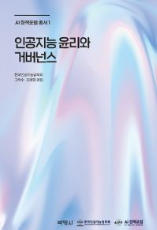
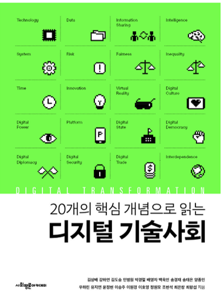

<body bottommargin="0">


	


<!-- /.tiles -->

 
 
 
 
  
  
  
  
  
  
  

I,<a href="https://igf2019.sched.com/eunchangchoi"> 최은창 崔恩彰</a>,
am a Korean legal scholar focused on the interplay of emerging technologies, data, and intellectual property. I sit on the editorial board of <a href="https://www.technologyreview.kr/"> MIT Technology Review Korea </a> and as a Non-Resident Fellow of <a href="https://thefreeinternetproject.org/"> the Free Internet Project </a> at <a href="https://web.iit.edu/"> Illinois Institute of Technology</a>. My research examines the legal, policy issues associated with a governance framework for algorithmic accountability, data privacy and technology policy. Recently, I have carried out consultancy work for <a href="https://eng.kcc.go.kr/user/ehpMain.do"> Korea Communications Commission(KCC) </a>,<a href="https://www.kisdi.re.kr/"> Korea Information Society Development Institute(KISDI)</a>, and <a href="http://www.stepi.re.kr/eng"> Science and Technology Policy Institute(STEPI)</a>. I have contributed a chapter covering bias and accountability of algorithms in a research report <a href="http://kisdi.asia/kisdi/fp/kr/publication/selectResearch.do?cmd=fpSelectResearch&sMenuType=3&controlNoSer=4&controlNo=14218&langdiv=1"> "ICT-based Solutions to Social Problems in Intelligent Information Society"</a>. I am a member of 'AI Policy Forum' of<a href="http://kaail.or.kr"> the Korean Associaton for AI Law (KAAIL)</a>.  
  
  
 Previously, I was a Fellow of <a href="https://law.yale.edu/isp"> Information Society Project, Yale Law School</a> for which I served as a coordinator of Harvard-Yale-MIT Cyberscholar Working Group. I also have held an appointment as a Visiting Scholar of <a href="https://pcmlp.socleg.ox.ac.uk/about-us/"> Programme in Comparative Media Law and Policy</a>, housed in <a href="https://www.law.ox.ac.uk/centres-institutes/centre-socio-legal-studies/research-centre-socio-legal-studies"> the Centre for Socio-Legal Studies,</a> University of Oxford Law Faculty. I was an Invited Expert of <a href="https://www.w3.org/2011/07/privacy-ig-charter"> W3C Privacy Interest Group</a> and a Fellow of <a href="http://www.stepi.re.kr/eng"> STEPI</a>, a global think tank in the area of science and technology where I conducted research on regulatory science for public health. From 2018, I have been participating in Law Committee of <a href="https://ethicsinaction.ieee.org/">IEEE Global Initiative on Ethics of Autonomous and Intelligent Systems</a>, and its working groups <a href="https://standards.ieee.org/project/7003.html">'Algorithmic Bias'(P7003)'</a>,and <a href="https://standards.ieee.org/project/7002.html">'Data Privacy Process'(P7002)</a>. 
     
     
  My teaching experience includes 'Global Information Society and Policy' course at <a href="https://gsis.korea.ac.kr"> Korea University Graduate School of International Studies </a> and 'The Ethics in Information Systems' at <a href="http://biz.ewha.ac.kr/eng/"> Ewha Womans University Graduate School of Business</a>, <a href="https://www.facebook.com/Politics.Media">'Media and Politics'</a> at Konkuk University and 'International Intellectual Property Law' at <a href="https://www.mju.ac.kr/us/3422/subview.do"> Myongii University</a>, Seoul. In 2019, I have taught about a cooperative approach of 'AI Governance' at <a href="https://community.icann.org/display/GSEAPAC/APIGA+2019"> Asia Pacific Internet Governance Academy(APIGA)</a> organized by <a href="https://www.icann.org"> Internet Corporation for Assigned Names and Numbers (ICANN)</a> and lectured <a href=" https://www.itu.int/en/ITU-D/Regional-Presence/AsiaPacific/SiteAssets/Pages/Events/2019/Artificial-Intelligence-Overview-and-Applications/%5bITU%20CoE%5d%20AI%20Ethics%2c%20Security%2c%20Personal%20Data_Choi%20Sept%2017%202019.pdf">'AI: Ethics, Security, Personal Data and Governance'</a> at <a href="https://www.itu.int/en/ITU-D/Regional-Presence/AsiaPacific/Pages/Events/2019/Artificial-Intelligence-Overview-and-Applications.aspx"> ITU Centres of Excellence Network for Asia-Pacific Region</a> in Bangkok. Furthermore, I was also invited to discuss on data privacy in smart city mobility at a workshop <a href= "https://www.intgovforum.org/multilingual/content/igf-2019-ws-182-data-governance-for-smarter-city-mobility">'Data Governance for Smarter City Mobility'</a> organized by <a href= "https://www.hiig.de/en/project/data-governance/"> Humboldt Institute for Internet and Society (HIIG)</a> in Berlin. On the top of that, I delivered my speech on'IP Address and Cross-border Cooperation for Resolving the Cyber Attribution Challenge'at <a href="https://conference.apnic.net/48/program/schedule/#/day/6"> Asia Pacific Network Information Centre Conference </a> in Chiang Mai, Thailand.  
    
   Besides, from 2016 I've been serving for <a href= "https://english.kiga.or.kr"> Korea Internet Governance Alliance(KIGA)</a> representing South Korea's Internet Community at <a href="http://www.intgovforum.org/multilingual/content/igf-regional-and-national-initiatives"> National Regional Initiatives(NRI)</a> moderated by<a href="http://intgovforum.org/multilingual/"> the IGF Secretariat of United Nations Department of Economic and Social Affairs </a>, and have been involved in <a href="http://www.intgovforum.org/multilingual/content/bpf-internet-of-things-iot-big-data-and-artificial-intelligence-ai-2018">the Best Practice Forum(BPF) IoT-Big Data-AI</a>. At <a href="http://krigf.kr"> annual Korea Internet Governance Forum (Kr-IGF)</a>, I organized workshops on ethical framework for AI society, cybersecurity policy, and data governance. I have been elected as a member of <a href="https://www.aprigf.asia/members.html"> Multi-stakeholder Steering Group of Asia Pacific Regional IGF </a>. In 2010, with volunteers and public interest lawyers, I have launched <a href="http://www.povertyinfo.org"> the Global Poverty Public Awareness Project</a>(GP3Korea, <a href="http://www.povertyinfo.org"> www.povertyinfo.org)</a> that generates openly accessible knowledge about <a href= "http://povertyinfo.org/300.9_issues.html"> issues (like climate change, access to medicine, corruption)</a> affecting global poverty, and <a href="http://www.un.org/en/sections/issues-depth/big-data-sustainable-development/index.html"> how open data analytics facilitate</a> sustainable global development. <a href="http://www.povertyinfo.org">Povertyinfo.org</a> is a digital media project for humanitarian ends that has been inspired by<a href="https://law.yale.edu/isp/about/initiatives/access-knowledge"><i> Access to Knowledge</i> </a> initiative, information commons, and <a href= "https://civic.mit.edu/"> Civic Media at MIT</a>. The public interest project has adopted MediaWiki-based content management, and decentralized participant-driven working method. I received my law degree from <a href="https://law.yale.edu/"> Yale Law School</a>, serving a editor of  <a href="https://yjolt.org/"> Yale Journal of Law & Technology</a>, and <a href="https://www.yalejreg.com"> Yale Journal on Regulation.</a> I also graduated from <a href="http://law.snu.ac.kr/index_en.php"> Seoul National University Graduate School of Law,</a> and hold certificates from Duke-Geneva Institute in Transnational Law at <a href="https://www.unige.ch/droit/en/international"> Université de Genève</a>, Switzerland, and from Intetnet Law Program at<a href="https://www.cyber.harvard.edu/"> Berkman Klein Center Internet & Society,</a> <a href="https://hls.harvard.edu"> Harvard Law School</a>.
 
 
 <strong> PUBLICATIONS (BOOKS, CHAPTERS, POLICY PAPERS) </strong>   
▪"Who Owns'Baby Shark Dance'?:Copyright Dispute over Meme Phenomenon" Harvard J of Law and Technology (Fall 2021)  
▪ Book Chapter, "Technology Risk" in <i> The Key Concepts of Science Technology and Society </i>, Publisher 社會評論(Oct.2021)  
▪ "The Leviathan Rises From the Deep:Battle of Tech Giants"<a href="https://www.orfonline.org/series/the-cyfy-edit/"> CyFy Edit</a>(Indian journal on technology)(Oct. 2021)   
▪ Book <i> Automated Algorithms as a New Institution: Socio-Legal Perspective on AI</i>, Publisher Hanul MPlus (forthcoming 2022)  
▪ Policy Report, "AI Governance: Issues, Principles, and Practices" AI Governance Forum Korea (Aug.2021)  
▪ "The Shade of Gig Economy: On-demand Food Delivery Platforms and Strikes Against Algorithms" MIT Technology Review Korea (Aug. 2021)  
▪ "Patent Waiver of COVID 19 Vaccine for Global Public Health"BioWave Vol.23,No.9,<a href="https://www.ibric.org/biowave/bio_webzine_index.php"> BRIC</a>(Sept.2021) 
▪ <a href="https://www.ibric.org/myboard/read.php?Board=report&id=3843">"CRISPR-Cas9 Patent War and the Implication for Microbial Sciences"</a>BioWave Vol.23, No.8,BRIC(Aug 2021) 
▪ <a href="https://www.technologyreview.kr/communicatioins-decency-act-misinformation/">"Will the CDA Section 230 Reform Reduce Dis/Misinformation in Digital Platforms?" </a> MIT Technology Review Korea (May 2021)  
▪ <a href="https://www.technologyreview.kr/why-data-ethics-is-important-in-ai-business/"> "Why Data Ethics Matters to AI Business ?"</a> MIT Technology Review Korea (April, 2021) 
▪ <a href="https://www.technologyreview.kr/why-ai-chatbots-fail-lee-luda-part-1/"> "Why AI Chatbots Fail ?:The Ethics of Lee Luda's Discriminatory Remarks" I</a>, <a href="https://www.technologyreview.kr/why-ai-chatbots-fail-lee-luda-part-2/"> II</a> MIT Technology Review Korea (March, 2021) 
▪  <a href="https://www.kisdi.re.kr/report/view.do?key=m2101113025377&arrMasterId=4333446&masterId=4333446&artId=555875"> "The History of Chatbots and Policy: Rethinking Eliza, GPT-3, & Lee Luda"</a> <i> AI Outlook </i> Vol.4 <a href="https://www.kisdi.re.kr/eng/index.do"> KISDI </a> (April 2021) 
▪  "The Difference of AI Risk Perception and Governance Modes" in <a href="https://www.kyobobook.co.kr/product/detailViewKor.laf?mallGb=KOR&ejkGb=KOR&barcode=9791130337722&orderClick=LA6"><i> Ethics and Governance of AI </i>,</a> Publisher 博英社(Jan. 2021)  
▪  Book Translation <a href="https://mitpress.mit.edu/books/memes-digital-culture"> <i> Memes in Digital Culture</i>,</a> Publisher MIT Press, Hanul MPlus(Aug.2021)   
▪  <a href="http://www.yes24.com/Product/Goods/87629913?scode=032&OzSrank=1"> <i> The Archaeology of Disinformation: How Fake News/Propaganda Manipulated Public Opinion from Ancient Rome to Social Media </i>,</a> Publisher 東亞細亞(2020). (Acclaims :<a href="https://www.pdjournal.com/news/articleView.html?idxno=71119"> PD Journal </a>, <a href="http://ch.yes24.com/Article/View/44483">Yes 24</a>, <a href="http://radio.sbs.co.kr/gorealra/player/?podId=P0000000874&vodId=V0000328499"> SBS Radio </a>, <a href="https://bit.ly/3aVFA4z"> Magazine Chaeg(冊)</a>, <a href="http://www.dt.co.kr/contents.html?article_no=2020030302103869061001"> Digital Times</a>, <a href="https://www.mk.co.kr/news/culture/view/2020/02/155878"> Maeil Business News</a>, <a href="https://www.asiae.co.kr/article/2020022811050161321&mobile=Y"> Asia Economy</a>, <a href="http://www.donga.com/news/article/all/20200216/99724450/1"> Dong-a Ilbo</a>, <a href="https://www.seoul.co.kr/news/newsView.php?id=20200313020005&wlog_tag3=naver"> Seoul Shinmun</a>,<a href="https://www.jnilbo.com/2020/02/20/2020022015101829561/"> Joennam Ilbo</a>, <a href="https://www.jjan.kr/news/articleView.html?idxno=2080584"> Jeonbuk Ilbo</a>, <a href="http://www.segye.com/newsView/20200214510584?OutUrl=naver"> Segya Ilbo</a>, <a href="https://www.kyosu.net/news/articleView.html?idxno=48054"> Kyosu Shinmun </a>, <a href="http://www.knnews.co.kr/news/articleView.php?idxno=1320910"> Kyoungnam News</a>,<a href="https://www.sedaily.com/NewsVIew/1YYX4ZYYI0"> Seoul Economic Daily</a>, <a href="https://www.ujeil.com/news/articleView.html?idxno=260732"> Ulsan Jeil</a>, <a href="https://www.hankookilbo.com/News/Read/202003161003380783"> Hankook Ilbo 1 </a>, <a href="https://www.hankookilbo.com/News/Read/202002131753026467?did=PA&dtype=3&dtypecode=4201">Hankook Ilbo 2 </a>,<a href="https://www.kwangju.co.kr/article.php?aid=1582191840689788026"> Kwangju Ilbo</a>, <a href="https://www.unipress.co.kr/news/articleView.html?idxno=771"> Univ Press </a>, <a href="https://www.fnnews.com/news/202002131701022957"> Financial News</a>, <a href="https://www.news1.kr/articles/?3842792"> News 1</a>,<a href="https://www.naeil.com/news_view/?id_art=341418"> Naeil News</a>, <a href="https://www.youtube.com/watch?v=MpeoOBXadZ8&feature=youtu.be&t=241"> Hellmouth </a>)  
▪  <a href="https://zdnet.co.kr/view/?no=20201201123601"> Personal Data Class Actions in Europe"</a>, ZDNet Korea (Dec.1, 2020)  
▪  <a href="https://github.com/eunchangchoi/Presentations/blob/master/The_Truth_that_the_History_of%20Fake_News_Says_to_Us_EunChangChoi2020.pdf">"The Truth that the History of Fake News Suggests Today"</a> Biweekly 企劃會議 Vol 518 (Aug. 2020)    
▪  Book Chapter "Solving the AI Accountability Gap" in Co-authored <a href="https://www.yes24.com/Product/Goods/62006191?scode=032&OzSrank=2"> <i> Artificial Intelligence and Power Shift,</i> </a> Publisher Samin(三仁) (2018)   
▪  <a href="https://nosmk.khealth.or.kr/nsk/user/extra/ntcc/nosmokeFile/fileView/jsp/Page.do?siteMenuIdx=81&dataNo=31&dataGr=4&fileNo=522&postIdx=562&level1Idx=8&level2Idx=31&datalv=1"> "California's Regulation on Flavored Tobacco Products:Menthol"</a>, Korea Health Promotion Institute (2018)    
▪ Policy Report <a href="https://bit.ly/3qgZ63S">"The Ethical Considerations of AI and Policy Response in the Age of Fourth Industrial Revolution"</a> KISDI, Commissioned Report submitted to <a href="https://www.4th-ir.go.kr/home/en/">The Presidential Committee on the Fourth Industrial Revolution of Korea</a>(Oct. 2018)   
▪ Policy Report "The WTO’s Decision on Australia’s Plain Packaging Tobacco Measures for Public Health: Trademark Restrictions", commissioned research by the Ministry of Health and Welfare, South Korea (2018) 
▪ Policy Report <a href="https://www.kisdi.re.kr/report/view.do?key=m2101113024770&arrMasterId=3934580&masterId=3934580&artId=520556">"ICT-based Solutions to Social Problems in Intelligent Information Society"</a> <a href= "https://www.kisdi.re.kr/eng/index.do%20%20%20%20KISDI"> KISDI </a>(2017)   
▪ <a href="https://stepi.re.kr/app/publish/view.jsp?mode=new&cmsCd=CM0012&div=&categCd=A0505&ntNo=33&sdt=&edt=&src=&srcTemp=&opt=N&currtPg=5"> "Algorithm Governance"</a> Future Horizon, Science and Technology Policy Institute (2017)   
▪ Book Translation <a href="http://www.kyobobook.co.kr/product/detailViewKor.laf?ejkGb=KOR&mallGb=KOR&barcode=9788946062726&orderClick=LAH&Kc="> <i> The Internet of Things,</i> </a> Publisher MIT Press (2015), Hanul MPlus (2017)  
▪ <a href="http://www.jksrnt.org/journal/view.html?doi=10.25055/JKSRNT.2016.7.2.74"> Factors Associated with Use of Menthol Cigarettes among Current Smokers in Korean university students and Male workers"</a> Journal of the Korean Society for Research on Nicotine and Tobacco (July 2016)  
▪ Book Chapter "How to Hold AI Robots Accountable?" in <a href="https://bit.ly/3cT4dSs"> <i> How to Build a Better Future:AI, the Fourth Industrial Revolution and Future of Humanity </i> </a> <a href="https://www.stepi.re.kr/site/stepien/main.do"> Science & Technology Policy Institute </a> (2016)   
▪  Co-authored Book <a href= "http://view.copyright.or.kr:8080/SynapDocViewServer/viewer/doc.html?key=000000006ba186290172c9470e3d36b4&contextPath=/SynapDocViewServer"> <i> Digital Copyright and Technology Terminology </i> </a>, <a href="https://www.copyright.or.kr/eng/main.do"> Korea Copyright Commission </a>(2016)  
▪ "The Legal and Ethical Controversies of AI" <a href="https://www.stepi.re.kr/app/publish/view.jsp?mode=topic&cmsCd=CM0160&ntNo=28&categCd=A0505&drctr=A030403&sdt=&edt=&src=&srcTemp=&sort=PUBDATE&currtPg=1"> <i> Future Horizon (Spring 2016) </i> </a>, Science and Technology Policy Institute (STEPI)   
▪ Book Published <a href="http://www.kyobobook.co.kr/product/detailViewKor.laf?barcode=9791130437002&orderClick=357"> <i> The Layered Model of Internet Regulation, </i></a> Publisher Communication Books (2015)   
▪ Book Translation <a href="https://www.kyobobook.co.kr/product/detailViewKor.laf?mallGb=KOR&ejkGb=KOR&barcode=9791130435473"> <i> The Wealth of Networks: How Social Production Transforms Markets and Freedom </i> </a> written by <a href="https://hls.harvard.edu/faculty/directory/10071/Benkler"> Prof. Yochai Benkler </a> <a href="http://www.benkler.org/Benkler_Wealth_Of_Networks.pdf"> Yale University Press</a> (2005), Communication Books Korea(2015) (Acclaims: <a href="https://hankyung.com/life/article/2015041693541"> Hankuk Economy </a>, <a href="https://hankookilbo.com/News/Read/201504171632164530"> Hankook Ilbo </a>, <a href="https://slownews.kr/50013"> Slow News 1 </a>, <a href="https://slownews.kr/50036"> Slow News 2</a>, <a href="https://www.bloter.net/archives/241128"> Bloter </a>, <a href="https://www.veritas-a.com/news/articleView.html?idxno=164861"> Veritas </a>, <a href="https://www.mediatoday.co.kr/news/articleView.html?idxno=125603"> Media Today</a>, <a href="https://www.digitaltoday.co.kr/news/articleView.html?idxno=65605"> Digital Today </a>, <a href="https://www.opinionnews.co.kr/news/articleView.html?idxno=18408"> Opinion News</a>,<a href="https://act.jinbo.net/wp/8766/"> JinboNet</a>, <a href="https://www.ohmynews.com/nws_web/mobile/at_pg.aspx?cntn_cd=a0002543828"> OhmyNews</a>)  
▪ <a href="http://wealthofnetworks.kr"> <i>The Wealth of Networks:How Social Production Transforms Markets and Freedom</i> </a> (Book Excerpts in Korean)  
▪ "The U.S. Supreme Court's Ruling on BRCA1/BRCA2 Gene Patent:Bioethical and Legal Implication" <a href="https://lst.go.kr/eng/index.do"> Korea National Institute for Bioethics Policy </a>(2014). Elected as the author of commissioned research paper through competition    
▪"Regulatory Science for Public Health and Safety: Lessons from the U.S. Food and Drug Administration's Approaches,<a href="https://www.stepi.re.kr/site/stepien/main.do"> Science & Technology Policy Institute, </a>STEPI Fellowship Research Paper Series(2014) 
      
 <strong> CONFERENCES, TALKS, PRESENTATIONS </strong>     
▪ 'Disinformation in the Cultural History of Epidemics'<a href="https://sll.seoul.go.kr/lms/simin_course/courseRequest/doSiminUnivMain.dunet?mnid=201510753401"> Continuing Studies, Seoul Metropolitan Government</a> (Aug.2021)   
▪ 'Data Sharing and Data Privacy:The Limit of Differential Privacy' Tutorial, Korea Internet Governance Forum(Aug.2021)    
▪ 'Risk Constructivism and Cultural Cognition', <a href="http://cis.snu.ac.kr/sub2/2_2_6_2.php?mode=view&number=1509&b_name=meet1_2">The Evolution of Technology & Society Conference </a>, SNU + KISA (June.2021) 
▪ 'The Politicizing Science and Scientific Uncertainty in Epidemiology", Graduate School of Public Health, Yonsei Univ (June.2021) 
▪ 'The Role of Experts Witness in Toxic Tort Ligitation" The Korean Society for Research on Nicotine (May.2021) 
▪  Author Talk <a href="https://youtu.be/mRsfLzJmdj8?t=15"> "How False Information Spreads?"</a> at <a href="http://factcheckweek.com/html/02/01.php">'Factcheck Week'</a> by <a href="https://kcc.go.kr/user/ehpMain.do"> KCC </a> and <a href="https://kcmf.or.kr/cms/"> Community Media Foundation </a> (April 2021)  
▪  <a href="https://aisummit.co.kr/ais2020_eun-chang-choi/?lang=en">'Ethical AI: A New Corporate Social Responsibility'</a>, <a href="https://aisummit.co.kr/?lang=en"> AI Summit 2020, </a> Seoul COEX Mall, <a href="https://www.digitalmarketingkorea.co.kr"> DMK </a>, Seoul (Dec.2020)  
▪ 'Blockchain in Media Value Chain and Copyrights Management',<a href="http://www.cybercom.or.kr/?m=bbs&bid=notice_&uid=1134"> Cybercommunication Academic Society</a>, Seoul (Nov.2020)  
▪  <a href="https://www.intgovforum.org/multilingual/content/igf-2020-main-session-nris-role-of-the-internet-in-emergency-situations">'The Role of the Internet in Emergency Situations'</a>, The United Nations Internet Governance Forum, (Nov.2020)    
▪  <a href="http://www.koica.go.kr/koica_kr/985/subview.do?enc=Zm5jdDF8QEB8JTJGYmJzJTJGa29pY2Ffa3IlMkYyOTMlMkYzNjM4NTklMkZhcnRjbFZpZXcuZG8lM0ZwYWdlJTNEMSUyNnNyY2hDb2x1bW4lM0QlMjZzcmNoV3JkJTNEJTI2YmJzQ2xTZXElM0QlMjZiYnNPcGVuV3JkU2VxJTNEJTI2cmdzQmduZGVTdHIlM0QlMjZyZ3NFbmRkZVN0ciUzRCUyNmlzVmlld01pbmUlM0RmYWxzZSUyNnBhc3N3b3JkJTNEJTI2"> 'Blockchain for Humanity and Development Agenda'</a>,Development Cooperation Forum of<a href="http://www.koica.go.kr/sites/koica_en/index.do"> KOICA </a>, <a href="https://youtu.be/BunQy8hsnVQ?t=5742"> Video </a> (Oct.2020)  
▪  'Technology Risks and Scientific Uncertainty' Technology and Society Forum, Seoul National University (Sept.2020) 
▪  <a href="http://www.igf.or.kr/2554">'Global Landscape of AI Ethics Principles: Soft Law or Hard Law?'</a>, Korea Internet Governance Forum (Aug. 2020)   
▪  'South Korea's Contacts Tracing for COVID-19: Balancing between Public Health and Privacy', <a href="https://www.slideshare.net/secret/vlJ18LSZxcB11J"> Slides </a>, <a href="https://youtu.be/4UZlkRLKGes"> Video </a>(Aug.2020)   
▪  <a href="https://www.kaobe.or.kr/home/board/view.php?pid=notice&act=view&num=100">'Business Ethics for Ethical AI: The Function of AI Ethics Board'</a> Korea Academy of Business Ethics Conference(Aug.2020)   
▪  'Medical Misinformation and Scientific Uncertainty:COVID19,Ebola & HIV/AIDS', Korea Society of Internet Ethics Conference  
▪  <a href="https://www.slideshare.net/EunChangChoi/internet-meme-warfare-political-propaganda-commercial-ads-copyright-lawsuits"> 'Internet Memes Warfare: Political Propaganda, Commercials and Copyrights'</a> Cybercommunication Academic Society, Seoul (2020) 
▪  'How Misinformation and Myths Obstruct Public Health Measures in Pandemic", Graduate School of Public Health, Yonsei Univ (2020) 
▪ <a href="https://bit.ly/36qHFoj">'The Risk Perception of AI'</a>, Korean Association for AI and Law (KAAIL) AI Policy Forum + Microsoft(Oct. 2019)  
▪ <a href="https://clawar.org/wp-content/uploads/2019/11/ICRES2019_p64_paper_4.pdf">"The Making of South Korea's Robot Ethics Charter"</a>, <a href="https://www.icres2019.org/"> International Conference on Robot Ethics and Standards</a>, London, UK (2019) 
▪   <a href= "https://www.intgovforum.org/multilingual/content/igf-2019-ws-182-data-governance-for-smarter-city-mobility">'Data Governance for Smarter City Mobility'</a>  <a href= "https://www.igf2019.berlin/IGF/Navigation/EN/Home/home.html"> The United Nations Internet Governance Forum</a>, Berlin, Germany (2019)  
▪   <a href="https://www.youtube.com/watch?v=nsZJaB3fx0E&feature=youtu.be&t=1689">'National Collaborative Session on Cybersecurity'</a>, <a href= "https://www.igf2019.berlin/IGF/Navigation/EN/Home/home.html">The United Nations Internet Governance Forum,</a> Berlin, Germany (2019)   
▪   <a href="https://www.itu.int/en/ITU-D/Regional-Presence/AsiaPacific/Pages/Events/2019/Artificial-Intelligence-Overview-and-Applications.aspx">'AI: Ethics, Security, Personal Data and Governance'</a> ITU Academy, Centres of Excellence, Bangkok,Thailand (2019)   
▪   <a href="https://youtu.be/uRsC_ypHGCg?t=1348">'IP Address and Cross-border Cooperation for Resolving the Cyber Attribution Challenges'</a>, <a href="https://conference.apnic.net/48/program/schedule/#/day/6/cooperation-sig">APNIC 48</a>,Chiang Mai,Thailand (2019)  
▪   <a href="https://www.ftp.asia/index.php/s/tLZWIWMG1Qp7oA0">'Build Concept on AI Society for Good: Quest for Inclusion'</a>,<a href="https://2019.aprigf.asia/"> 2019 Asia-Pacific Internet Governance Forum</a>, Vladivostok, Russia  
▪   <a href="https://www.ftp.asia/index.php/s/HGkuD3YVUBssKrP">'Coping with Misinformation in an Deluge of Information'</a>, <a href="https://2019.aprigf.asia/"> 2019 Asia-Pacific Internet Governance Forum</a>, Vladivostok, Russia  
▪   'AI Governance'in <a href="https://kpc4ir.kaist.ac.kr/index.php?mid=kpc4ir_events&document_srl=684"> TECH & TALK Conference</a>,<a href="https://kpc4ir.kaist.ac.kr/"> Korea Policy Center for 4th Industrial Revolution, KAIST,</a> Seoul (May. 2019) 
▪   <a href="https://youtu.be/92cmsMv6xhQ?t=451">'AI Ethics & Governance: Multistakeholder Approach'</a>, 2019 <a href="http://krigf.kr/"> Korea Internet Governance Forum</a>, Seoul, South Korea  
▪   'Global AI Ethics Governance' Korea Information Society Development Institute, South Korea (Sept. 2018)   
▪   'AI Ethics, Policies & Governance: A Global Overview' The Korea Society of Internet Ethics Conference (Nov.2018)  
▪   <a href="https://www.youtube.com/watch?v=quo1DLyitf8&feature=youtu.be&t=1004">'Fake News Workshop'</a>, <a href="https://igf2018.fr/"> The UN Internet Governance Forum </a> at UNESCO, Paris, France (Nov.2018)  
▪   'Artificial Intelligence Applications for Global Public Health' National Medical Center(NMC), Seoul, South Korea (Oct. 2018) 
▪  <a href="http://idr.jinbo.net/232"> 'Will You Trust Artificial Intelligence's Decision?'</a> AI Lecture Series, Institution for Digital Human Rights, Seoul (Dec.2017)  
▪  <a href="https://blog.naver.com/gp3project/221112176044">'Can Blockchain Technology Help the Unbanked around the World?: Financial Inclusion'</a> Povertyinfo.org's blog (Oct.2017) 
▪ <a href= "https://www.cis.snu.ac.kr/sub2/2_2_6_3.php?mode=view&number=223&page=1&b_name=meet1_3"> 'Cybersecurity in The Age of Internet of Things'</a> Seoul National University (Jan.2017)  
▪  <a href="http://cis.snu.ac.kr/sub2/2_2_6_2.php?mode=view&number=236&page=1&b_name=meet1_2"> 'Analysis on Stanford AI 100 Report'</a> Institute of International Studies, Seoul National University (Nov. 2016)  
▪ <a href="https://opennet.or.kr/wp-content/uploads/2015/08/발표자료-Net-Neutrality-OTT-Zero-ratinghandout-2015812-.pdf">'Net Neuteality in the new ICT Ecosystem :Zero-rating'</a> OpenNet Korea, Seoul (2015)  
   
    
 <strong> CONSULTING & ADVICES</strong>     
▪ Chief Data Ethics Officer (a qualified <a href="https://www.dataq.or.kr/www/sub/a_06.do"> Advanced Data Analytics Professional)</a> in <a href="https://labbit.kr/"> LABBIT,</a> a growth hacking company in Seoul  
▪ Panelist,'Myanmar's Internet Suppression and Democracy after Military Coup' Korea Internet Governance Forum (Aug.2021)    
▪ <a href="https://ap.rigf.asia/fellowship/2021/introducing-the-mentors-of-2021-fellowship-program/?fbclid=IwAR2pn3lY-fE0daHxOW4vCcvk0HX-zwFHd8uJxaPnT266Hn7BOkA52UudjMw"> Mentoring </a> for 2021 APrIGF Fellows,<a href="https://ap.rigf.asia/"> Asia Pacific Regional Internet Governance Forum(APrIGF)</a>    
▪ Panelist, Asian Pacific Table-top Exercise on the Human Element in Autonomous Weapon Systems,<a href="http://unidir.org"> UNDIR </a> (Feb. 2021) 
▪ Advised for the Ethical Framework for Designing Home Healthcare AI Robotics, Seoul National University of Education (April, 2021) 
▪ Consultated about Infodemic Scenarios of Disasters for The National Disaster Management Research Institute (May, 2020) 
▪ <a href="https://soundcloud.com/zion-lee-310060380/digikorea#t=22:52">'S.Korea's COVID 19 Contact Tracing, Legality, and Privacy Risk'</a> Interview with Sciences Po, France(Nov.2020)    
▪ Panelist, 'Autonomous Systems, Robustness, and Data' Interview with United Nations Institute for Disarmament Research (Nov.2020)   
▪ Consulted about Deepfake for <a href="https://https://www.kcc.go.kr/user/ehpMain.do"> the Korea Communications Commission </a>(Nov. 2019) 
▪ Consulted about Global Perspective on AI Ethics for <a href="https://www.kisdi.re.kr/"> Korea Information Society Development Institute </a>(Sept. 2019) 
▪ Paid Field Trips to U.S. FDA and UCSF Tobacco Research Center with officials of Ministry of Health and Welfare (2018)  
▪ Served for the Editorial Board of <a href="https://aipolicyexchange.org/"> AI Policy Exchange </a> 
▪ Member, the Expert Council of Robot Ethics at <a href="https://kiria.org/eng"> Korea Institute for Robot Industry Advancement</a>  
▪ Member, The Technical Committee on <a href="https://www.ieee-ras.org"> Robot Ethics in IEEE Robotcs & Automation Society </a>   
▪ Multi-Stakeholder Steering Group(MSG), <a href="https://ap.rigf.asia/"> Asia Pacific Regional Internet Governance Forum(APrIGF)</a>    
    
 <strong> IN THE NEWS & INTERVIEWS</strong>      
▪ <a href="http://www.danbinews.com/news/articleView.html?idxno=14304">'The Age of Disinformation and Misinformation'</a> Danbi News (April, 2021) 
▪ <a href="http://www.aitimes.com/news/articleView.html?idxno=133368">'AI Policy report released by AI Governance Forum at National Assembly of Korea'</a>, AI Times (Nov.7.2020)   
▪<a href="http://www.aitimes.com/news/articleView.html?idxno=133368">'AI Governance Forum pose to discuess AI policy suggestion'</a>, AI Times (Nov.3, 2020)   
▪<a href="https://www.mk.co.kr/news/economy/view/2020/10/1097127/">'Blockchain for Anti-Corruption and Financial Inclusion for the Unbanked'</a> Maekyung Business News (Oct. 2020)   
▪ <a href="http://www.mediaus.co.kr/news/articleView.html?idxno=192351"> 'COVID-19 Contact Tracing and Data Retention'</a> MediaUs (Sept.2020)    
▪ <a href="http://www.mediatoday.co.kr/news/articleView.html?idxno=208888">'South Korea's Scope of Contact Tracing for COVID-19 and Social Stigma'</a> MediaToday (Aug.2020)       
▪ <a href="https://www.diplomacy.edu/blog/will-algorithms-make-safe-decisions-foreign-affairs">'Will Algorithms Make Safe Decisions in Foreign Affairs?' </a> AI Lab, DiploFoundation, Geneva, Switzerland (Dec 17, 2019) 
▪ <a href="https://dig.watch/sessions/session-fakenews">'Fake News Session'</a>, 2018 Internet Governance Forum report, Geneva Internet Platform (Nov.2018)  
▪ <a href="https://www.donga.com/news/article/all/20170225/83056178/1">'AI becomes smarter…Is it a simple machine or artificial person?'</a>, Dong-a Ilbo (Feb.2017) 
▪ <a href="https://www.boannews.com/media/view.asp?idx=57022&kind=3">'Blockchain Platform, Hacking, and Security' </a> Boan Cybersecurity News (Sept.2017) 
▪ <a href="https://www.zdnet.co.kr/view/?no=20170915172456&from=Mobile">'Blockchain Paradigm:Information Security and Governance'</a> ZDNet Korea (Sept.2017) 
▪ <a href="https://www.inews24.com/view/913922">'The Economics of Zero-rating: Why Free Mobile Data Matters?'</a>, Startup Alliance, Seoul (Aug. 2015)  
  
     
 <strong> ACADEMIC INTERESTS </strong>     
   Law, Science and Technology (in Context of Science Technology and Society)  
   AI: Ethical and Legal Challenges (Governing AI), Accountability for Algorithms     
   Big Data Governance, Data Privacy, Data Ownership   
   Cloud Computing, Data Centers, Data Sharing   
   AI for Business Organizations and Business Ethics    
   The Power of Digital Platform, Platform Liability, Algorithmic Activism    
   Automated Content Moderation, Algorithmic Fair Use (Copyright)     
   Patenting Nature; CRISPR Patents;  Genomic Commons; Commodification of Bio-Information    
   Pharmaceutical Patents and Global Health Inequality: Access to Medicines    
   The Economic History of Intellectual Property and Technology     
  
   
   <strong> CONTACT</strong>     
   eunchang.choi@aya.yale.edu ; eunchang.choi@technologyreview.kr 
