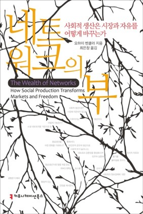

<body bottommargin="0">


	


<!-- /.tiles -->

 
 
 
 
  
  
  
  
  
  

I,<a href="https://igf2019.sched.com/eunchangchoi"> 최은창 崔恩彰</a>,
am a Korean legal scholar focused on information law, Internet policy and AI governance, and a Non-Resident Fellow of <a href="https://thefreeinternetproject.org/"> the Free Internet Project </a> at <a href="https://web.iit.edu/">Illinois Institute of Technology</a>. Initially, my research tackled legal issues with intellectual property, and later it gradually expanded to Internet governance, digital media, and the normative dimensions of emerging technologies. Currently my researches look into legal, policy issues associated with computer algorithm, data privacy and media Infrastructures. Since 2018 I have been invited to the Expert Council of Robot Ethics of <a href="https://www.k-robot.org/"> Korea Institute for Robot Industry Advancement</a>, and KAIST Fourth Industrial Revolution Intelligence Center. I provided expert advice to <a href="https://eng.kcc.go.kr/user/ehpMain.do"> Korea Communications Commission(KCC) </a>, <a href="https://www.kisdi.re.kr/"> Korea Information Society Development Institute(KISDI)</a>, <a href="http://www.stepi.re.kr/eng"> Science and Technology Policy Institute(STEPI)</a>. I contributed a chapter covering bias and accountability of algorithms in research report <a href="https://scienceon.kisti.re.kr/srch/selectPORSrchReport.do?cn=TRKO201800039359"> ICT-based Solutions to Social Problems in the Intelligent Information society"</a> and participated in 'AI Policy Forum', a part of<a href="http://kaail.or.kr"> Korean Associaton for Artificial Intelligence & Law </a> where I presented a paper titiled "Risk Perception of AI and Modality of Governance". More importantly I co-authored a policy report on <a href= "http://www.kisdi.re.kr/kisdi/fp/kr/publication/selectResearch.do?cmd=fpSelectResearch&sMenuType=3&controlNoSer=4&controlNo=14531&langdiv=1">"The Ethical Considerations of AI and Policy Response in the Age of Fourth Industrial Revolution"</a> submitted to the <a href="https://www.4th-ir.go.kr/home/en/">Presidential Committee on the Fourth Industrial Revolution.</a>
  
  
 Previously, I was a Resident Fellow of <a href="https://law.yale.edu/isp"> Information Society Project, Yale Law School</a>, where I served as a coordinator of Harvard-Yale-MIT Cyberscholar Working Group. I also have held an appointment as a Visiting Scholar of <a href="https://www.law.ox.ac.uk/research-and-subject-groups/programme-comparative-media-law-and-policy-pcmlp"> Programme in Comparative Media Law and Policy</a>, housed in <a href="https://www.law.ox.ac.uk/centres-institutes/centre-socio-legal-studies/research-centre-socio-legal-studies"> the Centre for Socio-Legal Studies,</a> University of Oxford Law Faculty. I was an Invited Expert of <a href="https://www.w3.org/2011/07/privacy-ig-charter"> W3C Privacy Interest Group</a> and a Fellow of <a href="http://www.stepi.re.kr/eng"> STEPI</a>, a global think tank in the area of science and technology where I conducted research on regulatory science for public health. From 2018, I have been actively participating in Law Committee of <a href="https://ethicsinaction.ieee.org/">IEEE Global Initiative on Ethics of Autonomous and Intelligent Systems</a>, and its working groups <a href="https://standards.ieee.org/project/7003.html">'Algorithmic Bias'(P7003)'</a>,and <a href="https://standards.ieee.org/project/7002.html">'Data Privacy Process'(P7002)</a>. My teaching experience includes 'Global Information Society and Policy' course at <a href="https://gsis.korea.ac.kr"> Korea University Graduate School of International Studies </a> and 'The Ethics in Information Systems' at <a href="http://biz.ewha.ac.kr/eng/"> Ewha Womans University Graduate School of Business</a>, <a href="https://www.facebook.com/Politics.Media"> 'Media and Politics'</a> at Konkuk University Department of Political Science,'International Intellectual Property Law' at<a href="https://www.mju.ac.kr/us/3422/subview.do"> Myongii University </a> and <a href="https://community.icann.org/display/GSEAPAC/APIGA+2019"> Asia Pacific Internet Governance Academy(APIGA)</a> organized by the <a href="https://www.icann.org"> Internet Corporation for Assigned Names and Numbers (ICANN)</a>.
 

 My publications consist of several books— <i>The Algorithm as Institution </i>(forthcoming), <a href="http://www.yes24.com/Product/Goods/87629913?scode=032&OzSrank=1"> <i> The Archaeology of Disinformation from Rome to the Era of Social Media </i></a>, and <a href="http://www.yes24.com/Product/Goods/17922053?scode=032&OzSrank=1"> <i> Layered Model of Regulation </i> </a>. I also co-authored <a href="https://www.yes24.com/Product/Goods/62006191?scode=032&OzSrank=2"> <i> AI:Power Shift and International Politics </i></a> with political scientists, and <a href= "http://view.copyright.or.kr:8080/SynapDocViewServer/viewer/doc.html?key=000000006ba186290172c9470e3d36b4&contextPath=/SynapDocViewServer"> <i> Digital Copyright Tech Terminology Dictionary </i></a>. Besides, I translated several books into Korean: <a href="https://cyber.harvard.edu/wealth_of_networks/Main_Page"> <i>The Wealth of Networks: How social production transforms markets and freedom </i> </a> written by <a href="https://hls.harvard.edu/faculty/directory/10071/Benkler"> Harvard Prof. Yochai Benkler </a> (Yale Univ Press), <a href="https://mitpress.mit.edu/books/memes-digital-culture"> <i> Memes in Digital Culture</i></a> (MIT Press),and <a href="http://www.kyobobook.co.kr/product/detailViewKor.laf?ejkGb=KOR&mallGb=KOR&barcode=9788946062726&orderClick=LAH&Kc="> <i> The Internet of Things</i> </a> (MIT Press). I also presented a paper titled <a href="https://clawar.org/wp-content/uploads/2019/11/ICRES2019_p64_paper_4.pdf">"The Making of South Korea's Robot Ethics Charter"</a> at 2019 <a href="https://www.icres2019.org/"> International Conference on Robot Ethics and Standards </a>in London. Besides, I delivered my speech on'IP Address and Cross-border Cooperation for Resolving the Cyber Attribution Challenge'at <a href="https://conference.apnic.net/48/program/schedule/#/day/6"> Asia Pacific Network Information Centre Conference </a> in Chiang Mai, Thailand, and taught <a href=" https://www.itu.int/en/ITU-D/Regional-Presence/AsiaPacific/SiteAssets/Pages/Events/2019/Artificial-Intelligence-Overview-and-Applications/%5bITU%20CoE%5d%20AI%20Ethics%2c%20Security%2c%20Personal%20Data_Choi%20Sept%2017%202019.pdf">'AI: Ethics, Security, Personal Data and Governance'</a> at <a href="https://www.itu.int/en/ITU-D/Regional-Presence/AsiaPacific/Pages/Events/2019/Artificial-Intelligence-Overview-and-Applications.aspx"> ITU Centres of Excellence Network for Asia-Pacific Region</a> in Bangkok. I illustrated the role of big data in smart city as a discussant in the workshop <a href= "https://www.intgovforum.org/multilingual/content/igf-2019-ws-182-data-governance-for-smarter-city-mobility">'Data Governance for Smarter City Mobility'</a> organized by <a href= "https://www.hiig.de/en/project/data-governance/"> Alexander von Humboldt Institute for Internet and Society (HIIG)</a> in Berlin, Germany. 
   
  
From 2017, as a committee member of <a href= "https://sites.google.com/a/kiga.or.kr/kiga-english/mission"> Korea Internet Governance Alliance(KIGA)</a> I represent South Korea's Internet Community at <a href="http://www.intgovforum.org/multilingual/content/igf-regional-and-national-initiatives"> National Regional Initiatives(NRI)</a> moderated by<a href="http://intgovforum.org/multilingual/"> the IGF Secretariat of United Nations Department of Economic and Social Affairs </a>, and have been involved in <a href="http://www.intgovforum.org/multilingual/content/bpf-internet-of-things-iot-big-data-and-artificial-intelligence-ai-2018">the Best Practice Forum(BPF) IoT-Big Data-AI</a> of it. At<a href="http://krigf.kr"> annual Korea Internet Governance Forum(Kr-IGF)</a>, I have organized workshops on ethical framework for AI society, cybersecurity policy, and data governance. In 2010, with college volunteers and public interest lawyers, I have launched <a href="http://www.povertyinfo.org"> the Global Poverty Public Awareness Project(Povertyinfo.org)</a> that disseminates open knowledge about global poverty, and <a href="http://www.un.org/en/sections/issues-depth/big-data-sustainable-development/index.html"> how open data analytics facilitate sustainable global development</a>. Povertyinfo.org is a digital media project for humanitarian ends that has been inspired by<a href="https://law.yale.edu/isp/about/initiatives/access-knowledge"><i> Access to Knowledge</i> </a> initiative, information commons, and <a href= "https://civic.mit.edu/"> Civic Media at MIT</a>. It has adopted MediaWiki-based content management, social media for dissemination and public engagement, and decentralized participant-driven working method. I am a graduate of <a href="https://law.yale.edu/"> Yale Law School</a>, and <a href="http://law.snu.ac.kr/index_en.php"> Seoul National University Graduate School of Law,</a> and hold certificates from Duke-Geneva Institute in Transnational Law at <a href="https://www.unige.ch/droit/en/international//"> Université de Genève</a>, Switzerland, and from Intetnet Law Program at<a href="https://www.cyber.harvard.edu/"> the Berkman Center Internet & Society, Harvard Law School.</a>  
       

 <strong> MEDIA & TALKS </strong>   
Acclaims of<i> the Archaeology of Disinformation </i>:<a href="https://www.pdjournal.com/news/articleView.html?idxno=71119"> PD Journal </a>, <a href="http://radio.sbs.co.kr/gorealra/player/?podId=P0000000874&vodId=V0000328499"> SBS Radio</a>, <a href="https://bit.ly/3aVFA4z"> Magazine Chaeg </a>, <a href="https://www.youtube.com/watch?v=MpeoOBXadZ8&feature=youtu.be&t=241"> Hellmouth</a>, <a href="http://www.dt.co.kr/contents.html?article_no=2020030302103869061001"> Digital Times</a>, <a href="https://www.mk.co.kr/news/culture/view/2020/02/155878"> Maeil Economy</a>, <a href="https://www.asiae.co.kr/article/2020022811050161321&mobile=Y"> Asia Economy</a>, <a href="http://www.donga.com/news/article/all/20200216/99724450/1"> Dong-a Ilbo</a>, <a href="https://www.seoul.co.kr/news/newsView.php?id=20200313020005&wlog_tag3=naver">Seoul Shinmun</a>,<a href="https://www.jnilbo.com/2020/02/20/2020022015101829561/"> Joennam </a>, <a href="http://www.segye.com/newsView/20200214510584?OutUrl=naver"> Segya</a>, <a href="https://www.kyosu.net/news/articleView.html?idxno=48054"> Kyosu Shinmun</a>, <a href="https://www.sedaily.com/NewsVIew/1YYX4ZYYI0"> Seoul Economy </a>, <a href="https://www.hankookilbo.com/News/Read/202002131753026467">Hankook </a>, <a href="https://www.unipress.co.kr/news/articleView.html?idxno=771"> Uni Press </a>, <a href="https://www.naeil.com/news_view/?id_art=341418"> Naeil News </a>  
 <a href="https://www.diplomacy.edu/blog/will-algorithms-make-safe-decisions-foreign-affairs">'Will Algorithms Make Safe Decisions in Foreign Affairs?' </a> AI Lab, DiploFoundation, Geneva, Switzerland  
<a href="https://www.youtube.com/watch?v=nsZJaB3fx0E&feature=youtu.be&t=1689">'National Representative Collaborative Session on Cybersecurity'</a> 2019 Internet Governance Forum, Berlin, Germany   
<a href="https://www.itu.int/en/ITU-D/Regional-Presence/AsiaPacific/Pages/Events/2019/Artificial-Intelligence-Overview-and-Applications.aspx"> AI: Ethics, Security, Personal Data and Governance'</a> ITU Asia-Pacific Region, Bangkok, Thailand   
<a href="https://youtu.be/uRsC_ypHGCg?t=1336">'IP Address and Cross-border Cooperation for Resolving the Cyber Attribution Challenge'</a> 2019<a href="https://conference.apnic.net/48/program/schedule/#/day/6/cooperation-sig"> APNIC 48</a>, Chiang Mai, Thailand 
<a href="https://www.ftp.asia/index.php/s/tLZWIWMG1Qp7oA0">'Build the Concept on AI Society for Global Good: Quest for Inclusion'</a> 2019 <a href="https://2019.aprigf.asia/prog"> Asia-Pacific Internet Governance Forum</a>, Vladivostok, Russia  
<a href="https://www.ftp.asia/index.php/s/HGkuD3YVUBssKrP">'Coping with misinformation in an era of information deluge?'</a> 2019 <a href="https://2019.aprigf.asia/prog"> Asia-Pacific Internet Governance Forum</a>, Vladivostok, Russia  
<a href="https://youtu.be/92cmsMv6xhQ?t=451">'AI Application and Ethics & Governance: Multistakeholder Approach'</a> 2019 <a href="http://krigf.kr/"> Korea Internet Governance Forum</a>, Seoul, South Korea  
<a href="https://kpc4ir.kaist.ac.kr/index.php?mid=kpc4ir_events&document_srl=684"> 'AI Governance'</a> in Tech & Talk Conference with, KAIST, Seoul, South Korea  
<a href="https://www.youtube.com/watch?v=quo1DLyitf8&feature=youtu.be&t=1004">'Fake News Workshop'</a>, 2018 Internet Governance Forum at UNESCO, Paris, France  
<a href="https://dig.watch/sessions/session-fakenews">'Fake News Session'</a>, 2018 Internet Governance Forum report by GIP Digital Watch, Geneva Internet Platform  
<a href="http://www.zdnet.co.kr/view/?no=20170915172456&from=Mobile">'Blockchain Paradigm: Information Security and Institutional Governance'</a> ZDNet Korea (Sept. 15, 2017) 
 <a href="www.donga.com/news/article/all/20170225/83056178/1">'AI becomes smarter…Is it a simple machine or artificial person?'</a>,  Interview with The Dong-a Ilbo (Feb.25, 2017) 
 <a href="https://opennet.or.kr/wp-content/uploads/2015/08/발표자료-Net-Neutrality-OTT-Zero-ratinghandout-2015812-.pdf">'Net Neuteality in the new ICT Ecosystem : OTT Service and Zero-rating'</a> The Open Net Korea, Seoul 
  <a href="http://wealthofnetworks.kr">The Wealth of Networks</a> (Book Chapters)<a href="http://https://www.hankyung.com/life/article/2015041693541"> Hankyoung</a>, <a href="http://https://www.hankookilbo.com/News/Read/201504171632164530"> Hankook Ilbo </a>, <a href="http://slownews.kr/50013"> Slow News 1</a>, <a href="https://slownews.kr/50036"> 2</a>, <a href="http://www.bloter.net/archives/241128"> Bloter </a>, <a href="http://www.veritas-a.com/news/articleView.html?idxno=164861"> Veritas </a>, <a href="http://www.mediatoday.co.kr/news/articleView.html?idxno=125603"> Media Today</a>, <a href="http://www.digitaltoday.co.kr/news/articleView.html?idxno=65605"> Digital Today </a>
      
      
  <strong> ACADEMIC INTERESTS </strong>     
   Data Governance, Data Privacy, Data Ownership, Anthropology of Data Centres  
   Legal Challenges of the Data Economy, Informational Capitalism  
   AI Policy, AI Alignment, Accountability for Algorithm  
   AI: Ethical and Legal Challenges (Governing AI) 
   Platform Liability, Automated Content Moderation    
   Internet Governance, Cybersecurity Norms and Attribution   
   Disinformation, Digital Public Sphere for Democracy   
   <a href="http://news.itu.int/introducing-ai-commons/">AI Commons,</a> Open Data for Sustainable Development  
   Global Intellectual Property Law, Copyright and Social Media  
   Pharmaceutical Patents and Global Health: Access to Medicines    
   The Cultural History of Law, Science, and Technology     
      
